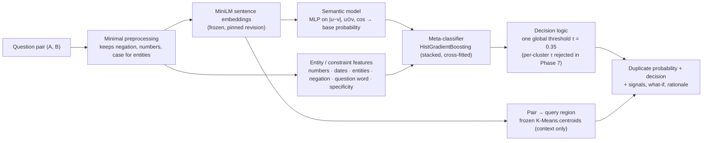

# Adaptive Semantic Query Matcher

Duplicate-question detection on Quora Question Pairs. The project tests whether **automatically discovered semantic query regions**,
**entity/constraint consistency** and **calibrated thresholds** improve on a single embedding-similarity threshold. It uses a leakage-controlled split,
pre-registered decisions and a frozen, one-time test evaluation.

**Result (held-out test, evaluated once):** the final system reaches **F1 0.786 / PR-AUC 0.834**, against **0.775 / 0.824** for the strongest
non-adaptive semantic baseline:
- F1 +0.011, 95% CI [+0.008, +0.014];
- worst-cluster F1 +0.026 [+0.010, +0.042];
- no query region gets worse.

The gain comes from **entity/constraint features**. **Cluster-specific thresholds did *not* help** when evaluated out of sample, so they were rejected
before the test run. That negative result is part of the findings.

## Problem

Semantic duplicate detection usually embeds two questions and applies **one global similarity threshold**. That fails in two predictable ways:

- **High-overlap non-duplicates.** "Who founded **Microsoft**?" / "Who founded **Apple**?", "lose **5** kg" / "lose **20** kg",
  "why do people **(not)** believe in God". These look almost identical to an embedding model but ask different things.
- **Region-dependent behaviour.** Different kinds of questions (definitions, product comparisons, personal advice, …) might need different
  decision thresholds.

**Research question:** can automatically discovered semantic query regions, entity/constraint consistency, and calibrated thresholds improve duplicate
detection beyond a single embedding-similarity threshold?

## Dataset

- **Quora Question Pairs** (Kaggle): 404,290 labelled pairs, 36.9% duplicates. Kaggle's own `test.csv` is unlabelled, so all train, validation and test data come from the labelled file.
- **Leakage control.** 61.3% of pairs contain a question that appears in other pairs. Under a random row split:
  - 58.4% of test pairs share a question with train;
  - a text-free transitive-label rule (A≡B, B≡C ⇒ A≡C) labels 21.1% of test pairs at 99.9% precision.
- **Question-disjoint split:** 80/10/10 (train 304,384 · validation 38,138 · test 38,420 pairs), with **zero questions shared** between splits.
  It retains 94.2% of pairs; large hub components are split per question and some cross-split pairs dropped
  ([docs/split_strategy.md](docs/split_strategy.md)).
- **Excluded inputs:** question frequency alone predicts the label with ROC-AUC 0.70 without reading any text, so frequency and graph features are excluded.
- **Test discipline:** the test split was read once, after every model, feature and threshold was frozen and hash-verified.

Scores are **not comparable** to random-split or Kaggle leaderboard numbers. A question-disjoint split is harder and has no leakage.

## Approach

| # | Step | Outcome (validation unless stated) |
|---|---|---|
| 1 | Lexical baseline: cosine TF-IDF, 11 overlap features | F1 0.618 / 0.659 |
| 2 | TF-IDF pair vector `[|v1−v2|, v1⊙v2]` + lexical features, logistic regression | **F1 0.730**, PR-AUC 0.771 |
| 3 | Siamese BiLSTM (PyTorch, shared encoder) | F1 0.732 (not significantly better than step 2) |
| 4 | Frozen `all-MiniLM-L6-v2` sentence embeddings + MLP head | **F1 0.771**, PR-AUC 0.824 (+0.041 F1 vs step 2) |
| 5 | Unsupervised K-Means query regions (K = 12) on train-question embeddings | stable regions, but silhouette ≈ 0.02 |
| 6 | Cluster-level error analysis | F1 varies 0.708–0.808 across regions, largely tracking duplicate prevalence |
| 7 | Entity/number/date/negation/specificity features + stacked meta-classifier | **F1 0.784**, PR-AUC 0.838 |
| 8 | Global vs per-cluster thresholds (cross-fitted within validation) | per-cluster thresholds **worse**; global kept |
| 9 | Frozen one-time test evaluation | **F1 0.786, PR-AUC 0.834** (test) |
| 10 | Streamlit demo, model registry, hash-verified reproducibility | `python scripts/reproduce.py --verify` |

## Architecture



## Key findings

All are measured, with sources in [docs/project_metrics.md](docs/project_metrics.md).

1. **Dense embeddings fix paraphrases.** MiniLM + MLP beats the best lexical model by +0.041 F1 (validation, CI [+0.036, +0.047]). False negatives on
   low-overlap duplicates fall from 46% to 28%.
2. **Raw embedding similarity is the weakest option on near-identical non-duplicates.** On high-overlap negatives, a cosine threshold wrongly accepts
   81% of number mismatches and 84% of negation mismatches (validation).
3. **Constraint features help where intended.** On the test split, false positives among high-overlap pairs with an entity, number or negation
   difference fall by 57%, 57% and 51% (0.174 → 0.075, 0.502 → 0.218, 0.641 → 0.315). The cost: true duplicates with a superficial constraint
   difference are rejected more often in those slices.
4. **Adaptive thresholds did not help.** Cross-fitted within validation, per-cluster thresholds *lowered* macro-cluster F1 by 0.003
   (CI [−0.005, −0.002]) for the final model. Their in-sample advantage was an artefact of fitting and scoring on the same pairs.
5. **The specificity/length signal is the largest single contributor** in the final model; numbers are the only explicit-constraint group significant on its own.
6. **The remaining errors are hard ones:**
   - *false positives:* about 27% look mislabelled, plus broader/narrower scope, different aspects of one topic, and role swaps;
   - *false negatives:* about 53% are paraphrases that need world knowledge or spelling robustness.
7. **The encoder saw Quora triplets in pretraining** (per its model card). With identical heads on identical data, an encoder with no listed Quora data
   scores 3.0–4.5 F1 points lower, so absolute scores are optimistic. The baseline-vs-final comparison is like-for-like.

## Clustering: what the query regions are, and are not

- **K-Means with K = 12** on 424,012 unique train-question embeddings. No duplicate labels were used to fit it, choose K, or name the clusters.
- **K = 12 was chosen on stability** (seed ARI 0.79, split-half ARI 0.80, measured over repeated fits). It also has the most balanced sizes.
  The usual internal metrics change monotonically with K and cannot pick it.
- **Silhouette ≈ 0.02 at every K.** The questions form a continuum, not separated groups. HDBSCAN, tried at 5 settings, labelled 32–100% of points as
  noise or found one dominant blob, so there is no usable density structure.
- **Cluster names** ("Definitions & technical concepts", "Product comparison", "India-specific", …) were written *after* clustering by reading each
  cluster. They describe regions of this dataset's embedding space, not universal question types.
- **Boundaries are soft:** 13% of questions sit within 0.02 cosine of a second centroid, and a third of validation pairs straddle two clusters.

## Evaluation (held-out test split, frozen thresholds from validation)

| System | τ | F1 | Precision | Recall | ROC-AUC | PR-AUC | Macro-cluster F1 | Worst-cluster F1 |
|---|---|---|---|---|---|---|---|---|
| TF-IDF pair + lexical LR (best Phase 2) | 0.32 | 0.7322 | 0.6623 | 0.8185 | 0.8759 | 0.7756 | 0.7241 | 0.5994 |
| Siamese BiLSTM (Phase 3) | 0.57 | 0.7362 | 0.6690 | 0.8185 | 0.8783 | 0.7810 | 0.7295 | 0.6011 |
| MiniLM cosine only (single similarity threshold) | 0.76 | 0.7330 | 0.6338 | 0.8691 | 0.8735 | 0.7666 | 0.7298 | 0.6444 |
| **Baseline:** MiniLM + MLP (Phase 3) | 0.32 | 0.7750 | 0.6988 | 0.8700 | 0.9064 | 0.8243 | 0.7709 | 0.6684 |
| **Final:** + entity/constraint meta-classifier | 0.35 | **0.7856** | **0.7154** | **0.8710** | **0.9144** | **0.8336** | **0.7824** | **0.6954** |

- **Final − baseline** (paired bootstrap): F1 +0.0106 [+0.0076, +0.0136]; PR-AUC +0.0092 [+0.0060, +0.0121]; macro-cluster F1 +0.0115; worst-cluster F1
  +0.0262 [+0.0097, +0.0417].
- **Recall is unchanged;** false positives fall from 5,177 to 4,782.
- **Calibration improves** (ECE 0.027 → 0.019). **Latency:** 11.1 vs 10.7 ms per pair in batch on CPU.

Full report: [docs/final_evaluation.md](docs/final_evaluation.md).

## Demo

```bash
streamlit run app/main.py
```

For any two questions the app shows:
- the **duplicate probability** and **decision**, flagged as borderline when within 0.05 of the threshold;
- the semantic model's probability alone, and the **semantic similarity**;
- the **discovered query region**;
- the **global threshold (0.35)**, with a note that **no cluster-specific threshold is applied** and why;
- the extracted **numbers, dates, entities, negation and question word**, and the **mismatch signals**;
- a model-based **what-if** ("if the numbers matched, the score would be 0.27") and a **deterministic rationale** (no language model).

Built-in examples include a paraphrase, entity, number, date, location and negation mismatches, a broader/narrower pair, and two **known failures**.
Guide: [docs/demo_guide.md](docs/demo_guide.md).

## Reproducibility

- **Model registry** (`artifacts/MODEL_REGISTRY.json`): 22 artifacts, each with role, content SHA-256, size, git status and the command that regenerates it.
- **Frozen final system in git:** MLP head, meta-model, threshold policies, cluster centroids, configs. The **encoder is pinned** to Hugging Face revision
  `1110a243…`, whose weight hash equals the one recorded at freeze time (`configs/models.yaml`).
- **Feature configuration** (`artifacts/feature_config.json`): the feature groups, ordered model inputs and input-canonicalisation rules.
- **Fixed expected outputs** (`tests/golden/`): 14 probe pairs whose scores, decisions, clusters and signals are re-checked to 1e-5.
- **`python scripts/reproduce.py --verify`** checks registry and freeze hashes, recomputes the reported test metrics from the saved per-pair scores,
  regenerates the split from the raw archive, and runs the tests.
- **Fresh clone, tested:** a clone plus the Kaggle archive regenerates byte-identical split files, passes 129 tests and skips 4 (feature caches and
  untracked reference models that need longer pipeline steps), and passes `--verify`.
- **Retraining** (`python scripts/reproduce.py --list`) is numerically close but **not bit-identical** for the neural and K-Means steps, because
  multithreaded floating-point reductions differ between runs. The committed frozen artifacts are the reference for every reported number.

Details: [docs/reproducibility.md](docs/reproducibility.md).

## Limitations

- **Cluster boundaries are soft** (silhouette ≈ 0.02); the 12 regions are a coarse coordinate, not ground-truth categories.
- **Cluster names are post-hoc interpretations,** not universal query types.
- **Labels are noisy and sometimes ambiguous.** About a quarter of the remaining false positives look mislabelled, and scope differences are judged inconsistently.
- **Results hold only for this frozen Quora Question Pairs split;** no claim is made about other datasets, domains or languages.
- **This is not a production system.** Robustness to real-world traffic, drift or adversarial inputs was not evaluated.
- **The encoder was pretrained partly on Quora data,** so absolute scores are optimistic.
- **Retraining the neural and K-Means steps is not bit-identical;** the frozen artifacts are the reference.

## Local setup

Requires Python 3.12 (developed on 3.12.2, Windows 11, CPU only).

```bash
git clone <this repository> && cd "Adaptive Semantic Query Matcher"
python -m venv .venv && .venv\Scripts\activate          # Linux/macOS: source .venv/bin/activate
pip install torch==2.14.1 --index-url https://download.pytorch.org/whl/cpu
pip install -r requirements.txt

# Demo and tests work right away (the first run downloads the pinned MiniLM encoder, ~90 MB)
streamlit run app/main.py
python -m pytest

# With the Kaggle archive quora-question-pairs.zip placed in the repository root:
python scripts/reproduce.py --run extract splits         # regenerates byte-identical split files
python scripts/reproduce.py --verify                     # hashes, recomputed test metrics, split, tests
python scripts/reproduce.py --list                       # the full pipeline, raw data -> final evaluation
```

## Documentation

| Document | Content |
|---|---|
| [docs/project_summary.md](docs/project_summary.md) | the whole project in one page |
| [docs/project_metrics.md](docs/project_metrics.md) | every measured number, with its source |
| [docs/interview_notes.md](docs/interview_notes.md) | design decisions, alternatives, trade-offs, likely questions |
| [docs/demo_guide.md](docs/demo_guide.md) | a 3–5 minute demo script |
| [docs/data_audit.md](docs/data_audit.md) · [docs/split_strategy.md](docs/split_strategy.md) · [docs/problem_definition.md](docs/problem_definition.md) · [docs/evaluation_plan.md](docs/evaluation_plan.md) | Phase 1 |
| [docs/baseline_results.md](docs/baseline_results.md) | Phase 2 lexical baselines |
| [docs/deep_models.md](docs/deep_models.md) | Phase 3 BiLSTM and sentence transformers, contamination control |
| [docs/clustering.md](docs/clustering.md) | Phase 4 K-Means vs HDBSCAN, stability, interpretation |
| [docs/cluster_error_analysis.md](docs/cluster_error_analysis.md) | Phase 5 per-cluster metrics and error categories |
| [docs/entity_constraint_features.md](docs/entity_constraint_features.md) | Phase 6 constraint features and meta-classifier |
| [docs/calibration_experiments.md](docs/calibration_experiments.md) | Phase 7 global vs cluster thresholds |
| [docs/final_evaluation.md](docs/final_evaluation.md) | Phase 8 frozen test evaluation |
| [docs/demo.md](docs/demo.md) · [docs/reproducibility.md](docs/reproducibility.md) | Phases 9–10 |
| [docs/final_verification.md](docs/final_verification.md) | final verification report |

## Project structure

```
app/main.py                      Streamlit demo (thin UI)
configs/                         data.yaml (split), clustering.yaml (K = 12), models.yaml (pinned encoder, final system)
scripts/                         one script per pipeline step; reproduce.py runs or verifies them all
src/preprocessing/text.py        minimal normalisation (keeps negation, numbers)
src/features/                    lexical.py (overlap features), constraints.py (entity/number/date/negation/specificity)
src/models/                      siamese_bilstm.py, sentence_encoder.py, meta.py, predictors.py
src/clustering/                  core.py (K-Means, frozen centroids), pairs.py (pair-to-cluster rules)
src/calibration/thresholds.py    global / per-cluster threshold policies with fallback, cross-fitting
src/evaluation/                  metrics, per-cluster analysis, error tags
src/service/matcher.py           demo service layer: frozen system + deterministic explanations
artifacts/phase1..8/             results, frozen models, thresholds, freeze manifest, test results
artifacts/MODEL_REGISTRY.json    artifact hashes and regeneration commands
tests/                           133 tests incl. golden outputs
docs/                            phase reports and summaries
```
