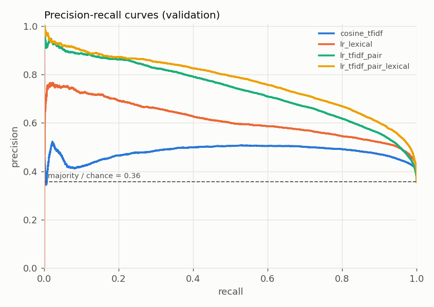
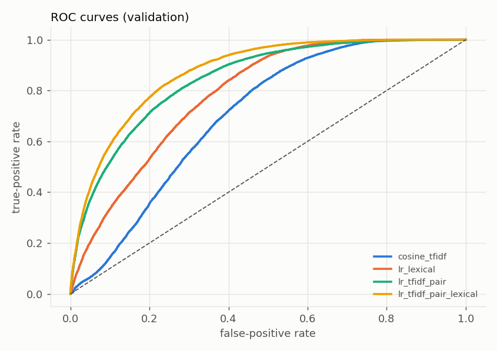
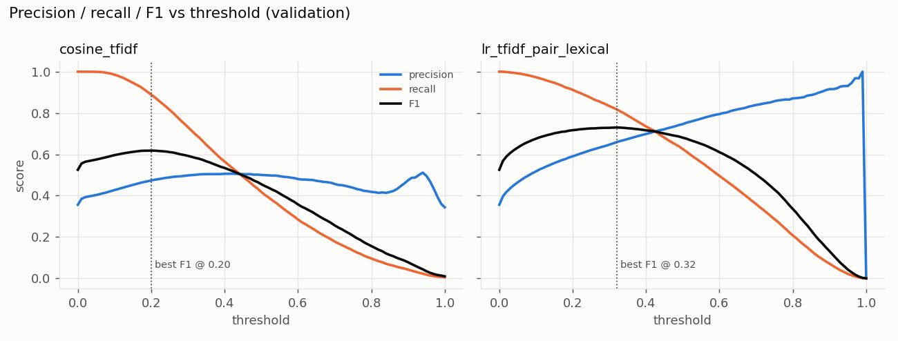
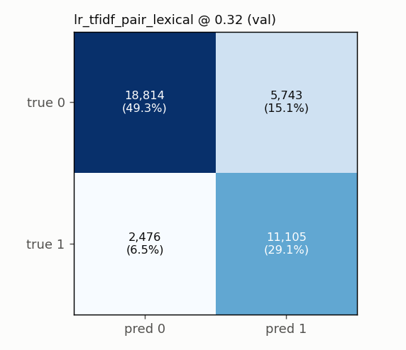

# Phase 2: Preprocessing and Lexical / Shallow-ML Baselines

All numbers are on the **validation** split (38,138 pairs, 35.6% positive). The test split was not opened.
The loader in `scripts/run_baselines.py` refuses to read it, and a test enforces that.

Reproduce:
```bash
python scripts/run_baselines.py            # ~10 min: trains, evaluates, plots, saves artifacts
python scripts/analyze_baseline_errors.py  # overlap-controlled error analysis from saved predictions
```
Artifacts: `artifacts/phase2/` (`baseline_metrics.json`, `threshold_sweeps.csv`, `val_predictions.csv`,
`error_analysis*.json`, `*.joblib`) and a log in `artifacts/logs/phase2_baselines.log`.

## 1. Preprocessing ([src/preprocessing/text.py](../src/preprocessing/text.py))

It is kept minimal on purpose, because the information that separates hard negatives is easy to destroy.

| Step | Done? | Why |
|---|---|---|
| Unicode NFKC, curly → straight quotes | yes | `don’t` and `don't` must tokenise identically |
| Lowercasing | yes | casing is too noisy on Quora to use as a signal (a raw copy is kept for later entity work) |
| Negation contractions → explicit `not` (`can't` → `can not`, `isn't` → `is not`) | yes | keeps polarity as a token |
| `[math]…[/math]` tags removed, formula text kept | yes | tag noise in 949 questions |
| Numbers preserved, including `3.5` and `1,000` | yes | numeric constraints (Phase 6) |
| Stop-word removal, stemming, lemmatisation | **no** | question words (*why/how*) and negations carry intent |
| Punctuation | dropped from word tokens (optional `keep_punct`) | rarely informative for bag-of-words |

## 2. Lexical features ([src/features/lexical.py](../src/features/lexical.py))

There are 11 features, all symmetric in (A, B): word Jaccard, content-word Jaccard (stop words removed but
negations and question words kept), common-word count, common/min-length ratio, common/max-length ratio,
character-3-gram Jaccard, absolute word-count difference, absolute character-length difference, length ratio,
first-word-equal and last-word-equal. Entity, number and negation *consistency* features are deferred to Phase 6.

## 3. Models

| Model | Description |
|---|---|
| `majority` | always predicts the train majority class (0) |
| `cosine_tfidf` | cosine between TF-IDF vectors of the two questions; no training beyond the IDF; threshold tuned on val |
| `lr_lexical` | standardised 11 lexical features → logistic regression |
| `lr_tfidf_pair` | TF-IDF (word 1–2-grams, min_df=2, sublinear tf; 356,522 terms, fitted on **train questions only**) → pair vector `[|v1−v2|, v1⊙v2]` (713,044 features) → logistic regression |
| `lr_tfidf_pair_lexical` | `lr_tfidf_pair` features + lexical features + TF-IDF cosine → logistic regression |

`[|v1−v2|, v1⊙v2]` is order-invariant: swapping A and B cannot change the score. It lets a linear model learn
both "this word is shared" (product) and "this word appears in only one question" (absolute difference).

**Tuning (validation only).** C ∈ {0.1, 0.3, 1, 3, 10} was chosen by validation PR-AUC, which is threshold-free.
The decision threshold was then chosen as the validation-F1-optimal value. The best C values are
0.1 (`lr_lexical`, which is flat across C), 3 (`lr_tfidf_pair`) and 1 (`lr_tfidf_pair_lexical`), all interior to the grid.
The first run used a grid ending at C = 3; `lr_tfidf_pair` peaked at that edge, so I extended it to 10 and re-ran.

## 4. Results (validation)

| Model | τ* | **F1** | Precision | Recall | ROC-AUC | PR-AUC | FPR | FNR | F1 @ 0.5 | F1, cross-half τ |
|---|---|---|---|---|---|---|---|---|---|---|
| majority | – | 0.000 | 0.000 | 0.000 | 0.500 | 0.356 | 0.000 | 1.000 | 0.000 | – |
| cosine_tfidf | 0.20 | 0.618 | 0.474 | 0.889 | 0.703 | 0.479 | 0.546 | 0.111 | 0.456 | 0.617 |
| lr_lexical | 0.23 | 0.659 | 0.514 | 0.919 | 0.786 | 0.614 | 0.480 | 0.081 | 0.539 | 0.660 |
| lr_tfidf_pair | 0.25 | 0.698 | 0.614 | 0.808 | 0.846 | 0.736 | 0.282 | 0.192 | 0.620 | 0.698 |
| **lr_tfidf_pair_lexical** | 0.32 | **0.730** | 0.659 | 0.818 | **0.874** | **0.771** | 0.234 | 0.182 | 0.681 | 0.729 |

How to read the last two columns:
- **F1 at the default 0.5** is 5–16 points lower than at the tuned threshold for every model. The F1-optimal
  threshold is 0.20–0.32, well below 0.5, as expected for a minority positive class. This is the first concrete
  evidence that "0.5" and "one fixed cut-off" are arbitrary choices.
- **Cross-half τ** is an optimism check. The threshold is tuned on one random half of val and F1 is measured on the other.
  It matches the in-sample F1 within 0.002, so tuning the threshold on val is not inflating these numbers.
- For reference, predicting "duplicate" for everything gives F1 = 0.525 (precision 0.356, recall 1.0).
  **Cosine TF-IDF is only 9 points above that.** It reaches its best F1 by predicting duplicate for most pairs (FPR 55%).

Calibration (probability models): Brier score / ECE = 0.178 / 0.045 (`lr_lexical`), 0.156 / 0.055 (`lr_tfidf_pair`),
**0.140 / 0.033** (`lr_tfidf_pair_lexical`).

Efficiency: `lr_tfidf_pair` scores 0.04 ms per pair in batch, including the TF-IDF transform, single-process CPU.
Serialised size is 6.0 MB (`lr_tfidf_pair`) and 8.0 MB (`lr_tfidf_pair_lexical`), compressed joblib.

**Best Phase 2 baseline: `lr_tfidf_pair_lexical`** (F1 0.730, PR-AUC 0.771). This is the bar the deep models in Phase 3 must beat.
These numbers use a question-disjoint split and are not comparable to leaky random-split results in the literature.

### Plots

| | |
|---|---|
|  |  |
|  |  |

In the threshold sweep, the precision of cosine TF-IDF stays at or below about 0.52 at every threshold. More lexical similarity
does not mean more likely duplicate beyond a point. The learned model has a monotone precision curve and a broad,
flat F1 plateau between 0.2 and 0.45.

## 5. Failure analysis

### 5.1 Lexical overlap is non-monotonic in this dataset

| Word Jaccard | ≤0.2 | 0.2–0.4 | 0.4–0.6 | 0.6–0.8 | 0.8–1.0 |
|---|---|---|---|---|---|
| val pairs | 11,927 | 12,127 | 7,464 | 4,418 | 2,202 |
| duplicate rate | 9.8% | 41.0% | 54.9% | 53.9% | **44.0%** |
| best model: FPR | 2.9% | 24.8% | 54.7% | **56.5%** | **53.9%** |
| best model: FNR | **45.5%** | 24.4% | 12.3% | 6.9% | 6.9% |

The most similar-looking pairs are *less* often duplicates than moderately similar ones. The same pattern holds on train
(Jaccard 0.8–0.99: 41% duplicates). These are templated questions that differ in one slot. The lexical model's errors split
cleanly: **false positives concentrate at high overlap** (FPR above 50% once Jaccard exceeds 0.4), and **false negatives at low overlap**
(it misses 46% of duplicates with Jaccard ≤ 0.2).

### 5.2 Are entity, number and negation differences the cause? (overlap-controlled)

The heuristic tags come from [src/evaluation/error_analysis.py](../src/evaluation/error_analysis.py) and are used for analysis only:
- `entity_diff`: a differing token is capitalised mid-sentence;
- `number_diff`: a differing token contains a digit;
- `negation_diff`: a negation appears in only one question.

The naive comparison is misleading. Negatives with an entity difference have a *lower* FPR overall
(12% vs 34%), because such pairs usually differ in many words. So the rates below are compared **within overlap bands**
(`artifacts/phase2/error_analysis_by_overlap.json`):

| Overlap band | Tag | Negatives with tag | FPR with | FPR without |
|---|---|---|---|---|
| ≤0.4 | any constraint diff | 11,535 | 5.7% | 22.3% |
| 0.4–0.6 | any constraint diff | 1,250 | 36.8% | 65.4% |
| >0.6 | entity_diff | 1,425 | **43.9%** | 64.5% |
| >0.6 | number_diff | 300 | **51.3%** | 56.0% |
| >0.6 | negation_diff | 61 | **63.9%** | 55.4% |
| >0.6 | any constraint diff | 1,742 | **45.9%** | 66.5% |

This supports several conclusions, stated honestly:
- The TF-IDF difference terms **already partly catch** constraint mismatches. At every overlap level, negatives with a
  detected entity or number difference are accepted less often than those without.
- Still, **among high-overlap negatives, 44–64% of constraint-mismatch pairs are wrongly accepted**. Number and negation
  differences get almost no protection (51% vs 56%, and 64% vs 55%, the latter from only 61 pairs).
- High-overlap pairs (Jaccard > 0.6) produce 1,817 false positives, **32% of all false positives**. Of those, 44% carry
  a detected constraint difference (34% entity, 8% number, 2% negation). The other 56% are attribute or word swaps
  the tags do not detect, or label noise (see below).

The explicit constraint features in Phase 6 therefore target a real but bounded slice of the errors.

### 5.3 Manual inspection (best model, τ = 0.32)

I read the 15 most confident false positives, the 15 most confident false negatives, and 20 random examples of each
(`artifacts/phase2/error_analysis.json`).

**False positives**
1. **Attribute / slot swaps in the same template**, the dominant pattern: "gain weight quickly" vs "**lose** weight quickly" (0.97);
   "advice to your **15**-year-old self" vs "**17**-year-old self"; "historical figures of **Mozambique**" vs "…of **Denmark**";
   "chemical formula for calcium **dinitrate**" vs "calcium **dioxide**"; the word "**sure**" vs "**so**"; "American women" vs "white women".
   Several are lowercase attribute words (gain/lose, sure/so) that no capitalisation-based entity tag detects.
2. **Same topic, different question (scope or specificity)**: "What is Arduino Uno?" vs "How reliable is the Arduino Uno?";
   "What are anabolic steroids?" vs "ways to take anabolic steroids"; "Does Quora earn money?" vs "How can I use Quora to make money?";
   "Will India ever become a superpower?" vs "How can India become a superpower?".
3. **Probable label noise**, i.e. pairs that read as duplicates but are labelled 0: "What is your favorite thing in the world?" vs
   "What's your favorite thing in this world?"; "Why did the Soviet Union invade Finland?" vs "…attack Finland?";
   "best way to develop a good personality" vs "How do I develop a good personality?". Several of the most confident
   false positives are of this kind, so part of the error floor is not fixable by any model.

**False negatives**
1. **Synonyms and paraphrases with little word overlap**: disadvantages / drawbacks; smartphones / mobile;
   "rational no." / "rational numbers"; "Is Jainism older than Hinduism?" vs "Which religion came first, Jainism or Hinduism?";
   "Is yawning contagious?" vs "Why are yawns contagious?". This is the main motivation for dense embeddings in Phase 3.
2. **Spelling, abbreviations and aliases**: "masturation" vs "masturbating"; "NEET II" vs "neet 2"; "fb" vs "Facebook";
   "U.A.E." vs "Abu Dhabi"; "i3" vs "I 3 processor".
3. **Broad topical duplicates.** Quora sometimes merges questions that differ in scope ("How do I join defence after
   graduation in mechanical engineering?" vs "How do I join IAF after MBBS?" is labelled 1). These are debatable positives.
4. **Template penalty on near-identical pairs.** "What is formwork?" vs "What is the formwork?" scores **0.008**. See the probes.

### 5.4 Sanity probes (hand-written, not from any split)

| Type | Pair | cosine | lr_lexical | lr_tfidf_pair | lr_tfidf_pair_lexical |
|---|---|---|---|---|---|
| identical | "What is formwork?" ×2 | 1.00 | 0.46 | **0.00** | **0.00** |
| identical | "Who founded Microsoft?" ×2 | 1.00 | 0.46 | 0.75 | 0.72 |
| paraphrase | "How can I lose weight quickly?" / "What is the fastest way to lose weight?" | 0.31 | 0.14 | 0.93 | 0.82 |
| entity mismatch | "Who founded Microsoft?" / "Who founded Apple?" | 0.67 | 0.33 | 0.28 | 0.16 |
| number mismatch | "lose 5 kg in a month" / "lose 20 kg in a month" | 0.63 | 0.59 | 0.38 | **0.50** |
| negation mismatch | "Why do people believe in God?" / "…not believe…" | 0.72 | 0.53 | 0.37 | **0.36** |
| broader / narrower | "learn programming" / "learn Python programming for data science" | 0.36 | 0.52 | 0.34 | **0.61** |

The best model accepts the number mismatch (0.50) and the broader/narrower pair (0.61), and it sits just above τ = 0.32
on the negation mismatch (0.36). It also gives **probability 0 to an exact duplicate**. The shared bigram `what is`
has weight −11.7, learned from the thousands of templated "What is X?" negatives, and "formwork" is outside
the min_df = 2 vocabulary, so nothing offsets it. The model has learned the dataset's templates, not a notion of equivalence.

## 6. Conclusions for later phases

1. **Beat 0.730 F1 / 0.771 PR-AUC** on the same validation split. That is the bar for the Phase 3 deep models.
2. A **tuned threshold matters more than the model choice** for some comparisons: tuning improves F1 by 5–16 points.
   Every later comparison uses validation-tuned thresholds.
3. False positives concentrate at high overlap, and false negatives at low overlap. Dense semantic encoders should help with
   the false negatives (synonyms, aliases). Whether they help with the high-overlap false positives is open, and that is what Phases 5–6 test.
4. Constraint mismatches (entity, number, negation) explain a real but bounded share of the high-overlap false positives.
   Label noise and lowercase attribute swaps explain much of the rest. Phase 6 improvements should be judged against that ceiling.
5. Negative results preserved: cosine similarity alone is barely better than predicting "duplicate" for everything,
   and C barely matters for the 11-feature lexical model.
