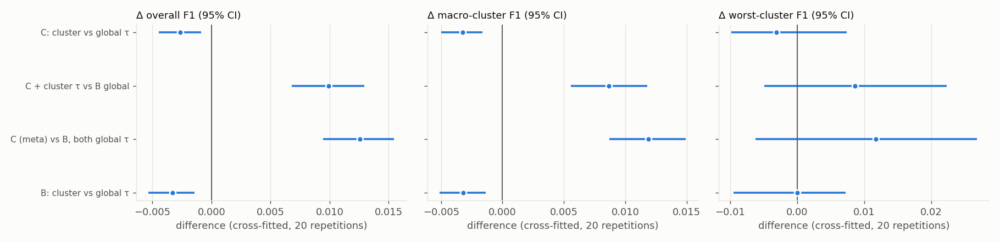
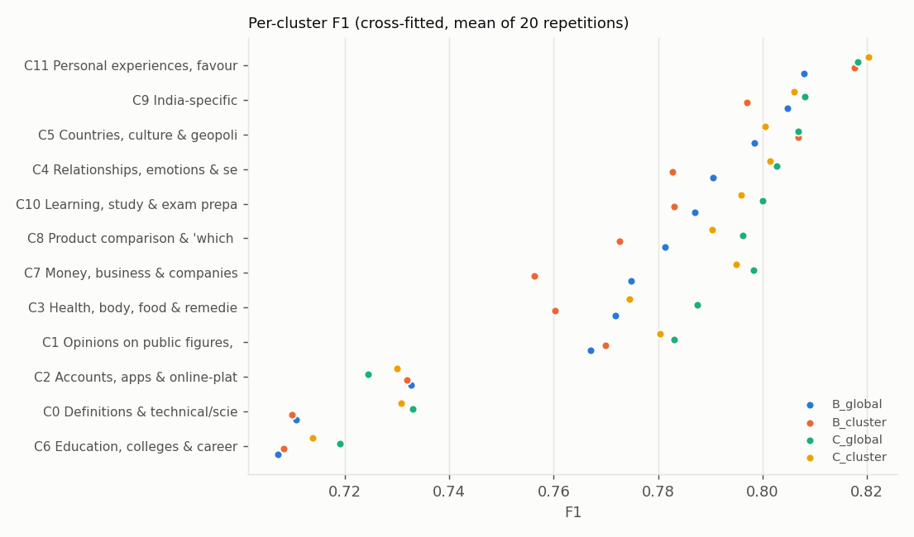
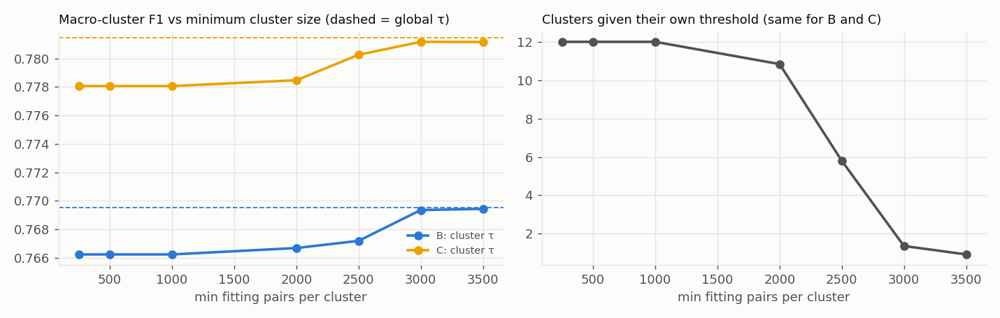

# Phase 7: Global vs Cluster-Calibrated Thresholds

**The central hypothesis:** semantic query regions behave differently, so thresholds calibrated *per cluster* should make duplicate detection more robust
than a single global threshold.

**Answer: no.** On this dataset, with these clusters, cluster-specific thresholds **significantly reduce** overall F1 and macro-cluster F1 once they are
evaluated out of sample, for both the semantic model and the entity/constraint-aware model. They do not improve the worst cluster. What *does* improve
robustness is the Phase 6 entity/constraint-aware model with a **single global threshold**. That is the configuration frozen for Phase 8.

All work is on the frozen **validation** split. Thresholds were learned only from validation, never set by hand. The test split was never read (enforced by tests).

> *Revision note:* these results come from re-running Phase 7 after the Phase 6 input canonicalisation found during the Phase 8 dry run
> (see [entity_constraint_features.md](entity_constraint_features.md)). The conclusion is unchanged from the first run, and slightly stronger.
> The earlier log is kept in `artifacts/logs/phase7_calibration_pre_canonicalisation.log`.

Reproduce: `python scripts/calibration_experiments.py` (about 10 minutes on CPU). Use `--plot-only` to redraw the figures from `artifacts/phase7/results.json`.

## 1. Why cross-fitting

Thresholds must be learned on validation, and the test set is reserved for Phase 8. Per-cluster thresholds tuned on validation and scored on the same
pairs win by construction:

| In-sample (optimistic: thresholds fitted and scored on the same pairs) | F1 | Macro-cluster F1 | Worst-cluster F1 |
|---|---|---|---|
| B: semantic model, global τ | 0.771 | 0.770 | 0.708 |
| B: semantic model, cluster τ | 0.777 | 0.775 | 0.710 |
| C: constraint-aware model, global τ | 0.784 | 0.782 | 0.721 |
| C: constraint-aware model, cluster τ | **0.788** | **0.786** | 0.722 |

So every system is **cross-fitted within validation**:
1. **Folds:** validation is split into 5 question-disjoint folds, assigning whole question-graph components.
2. **Fit and apply:** thresholds are fitted on 4 folds and applied to the held-out fold.
3. **Repetition:** repeated with **20 fold shufflings**; all systems share the same folds.
4. **Uncertainty:** a **paired bootstrap** (1,000 resamples of validation pairs) of the *repetition-averaged* difference.

`tests/test_calibration.py` checks that changing a fold's labels never changes that fold's own decisions.

## 2. Rules (fixed before running)

| Rule | Value |
|---|---|
| Threshold search | F1-optimal on a 0.01 grid (ties → lowest); no manual thresholds |
| Minimum size for a cluster's own threshold | **≥ 1,000 fitting pairs and ≥ 100 duplicates** (Phase 5 reliability: below about 1,000 pairs the threshold std is > 0.05) |
| Fallback | clusters below the minimum (or unseen) use the global threshold fitted on the same data |
| Pair → cluster | frozen Phase 4 centroids, Phase 5 pair-average rule |
| Decision rule for Phase 8 | adopt per-cluster thresholds only if they improve **macro-cluster F1 with a 95% CI excluding 0** *and* the CI of the overall F1 change is not entirely below 0 |

## 3. Systems compared

| # | System | Scores | Threshold |
|---|---|---|---|
| 1 | **Global threshold** (baseline) | B: Phase 3 semantic model | one global τ |
| 2 | **Cluster-specific thresholds** | B | per-cluster τ, global fallback |
| 3 | **Entity/constraint-aware classifier** | C: Phase 6 meta-model (`C_no_spacy_hgb`) | one global τ |
| 4 | **Combined** | C | per-cluster τ, global fallback |

System 4 is methodologically valid: the meta-model was trained on *train* only and never saw validation, and its cluster thresholds are cross-fitted.

## 4. Results (cross-fitted, mean of 20 repetitions)

| System | F1 | Precision | Recall | FPR | FNR | Macro-cluster F1 | Worst-cluster F1 |
|---|---|---|---|---|---|---|---|
| 1. B + global τ | 0.7706 | 0.693 | 0.868 | 0.213 | 0.132 | 0.7695 | 0.7071 |
| 2. B + cluster τ | 0.7674 | 0.697 | 0.853 | 0.205 | 0.147 | 0.7664 | 0.7075 |
| **3. C + global τ** | **0.7832** | **0.713** | **0.869** | 0.194 | **0.131** | **0.7815** | **0.7191** |
| 4. C + cluster τ | 0.7806 | 0.717 | 0.856 | 0.187 | 0.144 | 0.7782 | 0.7138 |

Range across the 20 repetitions: system 1 F1 0.769–0.771 and worst-cluster 0.706–0.708; system 3 F1 0.782–0.784 and worst-cluster 0.715–0.721.

| Comparison (paired bootstrap of the 20-repetition mean) | ΔF1 [95% CI] | Δ macro-cluster F1 | Δ worst-cluster F1 |
|---|---|---|---|
| **Cluster vs global τ, semantic model (2 vs 1)** | **−0.0033 [−0.0053, −0.0014]** | **−0.0032 [−0.0051, −0.0014]** | −0.0000 [−0.0095, +0.0072] |
| **Cluster vs global τ, constraint model (4 vs 3)** | **−0.0026 [−0.0045, −0.0009]** | **−0.0033 [−0.0050, −0.0016]** | −0.0031 [−0.0098, +0.0074] |
| Constraint model vs semantic model, both global (3 vs 1) | **+0.0125 [+0.0094, +0.0155]** | **+0.0119 [+0.0087, +0.0149]** | +0.0118 [−0.0062, +0.0268] |
| Combined vs baseline (4 vs 1) | +0.0099 [+0.0068, +0.0129] | +0.0087 [+0.0056, +0.0118] | +0.0086 [−0.0049, +0.0223] |

Reading the table:
- **Cluster thresholds hurt, significantly, for both models,** on overall F1 and on macro-cluster F1, the very robustness metric they were meant to improve.
- They **do not help the worst cluster** (C6 Education).
- **The entity/constraint-aware model is the only intervention that improves robustness:** +0.012 overall and +0.012 macro-cluster F1, both significant.
  Its worst-cluster gain (+0.012) holds in direction in all 20 repetitions (0.715–0.721 vs 0.706–0.708), but its bootstrap CI includes 0, since the
  minimum over 12 noisy cluster estimates is itself noisy.
- Adding cluster thresholds on top of the constraint model gives back part of its gain.

**Pre-registered decision:** cluster thresholds rejected for B (macro Δ CI entirely < 0) and for C (macro Δ CI entirely < 0).

### Per cluster

| Cluster | B global | B cluster τ (Δ) | C global (Δ vs B global) | C cluster τ (Δ vs C global) |
|---|---|---|---|---|
| C0 Definitions | 0.711 | −0.001 | **+0.022** | −0.002 |
| C1 Opinions & beliefs | 0.767 | +0.003 | +0.016 | −0.003 |
| C2 Accounts & apps | 0.733 | −0.001 | **−0.008** | +0.006 |
| C3 Health & body | 0.772 | **−0.012** | +0.016 | **−0.013** |
| C4 Relationships | 0.791 | −0.008 | +0.012 | −0.001 |
| C5 Countries | 0.798 | +0.008 | +0.008 | −0.006 |
| C6 Education (worst) | 0.707 | +0.001 | +0.012 | −0.005 |
| C7 Money & business | 0.775 | **−0.019** | **+0.023** | −0.003 |
| C8 Product comparison | 0.781 | −0.009 | +0.015 | −0.006 |
| C9 India-specific | 0.805 | −0.008 | +0.003 | −0.002 |
| C10 Learning & exams | 0.787 | −0.004 | +0.013 | −0.004 |
| C11 Personal experiences | 0.808 | **+0.010** | +0.010 | +0.002 |

- **Cluster thresholds:** a few clusters gain (C11, C5) and more lose (C7 −0.019, C3 −0.012). For the constraint model, 10 of 12 clusters lose.
- **Phase 5's one "clear" case also fails.** C4 had an in-sample optimum of 0.20 (bootstrap CI [0.18, 0.21]), but cross-fitted, its own threshold
  *lowers* its F1 (−0.008 for B). Phase 5's within-cluster bootstrap of the arg-max threshold understated how unstable a tuned threshold is on new data.
- **The constraint-aware model improves 11 of 12 clusters** at a single threshold; the exception is C2 (accounts/apps), whose errors are mostly paraphrases.

### Why the cluster thresholds fail: instability

Thresholds fitted in the 100 fold fits (20 repetitions × 5 folds):

| | Global τ: mean (std, range) | Per-cluster τ: std range | Per-cluster τ: widest min–max |
|---|---|---|---|
| B (semantic) | 0.319 (0.005, 0.30–0.34) | 0.005 – **0.075** | C7: 0.19 – 0.42 |
| C (constraint-aware) | 0.354 (0.010, 0.35–0.38) | 0.011 – **0.059** | C0: 0.33 – 0.53 |

A cluster threshold, fitted on about 2–4k pairs, moves by up to ±0.06 between folds; the global one, fitted on about 30k, barely moves.
The *true* between-cluster differences are modest and F1 curves are flat near their optima (Phase 5), so the variance from 12 noisy thresholds
outweighs the bias they remove.

## 5. Minimum cluster size and the fallback

| Minimum fitting pairs | Clusters with own τ (mean) | Macro-cluster F1, B | Macro-cluster F1, C |
|---|---|---|---|
| 250 / 500 / 1,000 | 12.0 | 0.7662 | 0.7781 |
| 2,000 | 10.8 | 0.7667 | 0.7785 |
| 2,500 | 5.8 | 0.7672 | 0.7803 |
| 3,000 | 1.4 | 0.7694 | 0.7812 |
| 3,500 | 0.9 | 0.7694 | 0.7812 |
| *global τ only* | 0 | *0.7695* | *0.7815* |

Performance improves **monotonically as fewer clusters get their own threshold**, converging on the global-threshold result. The fallback mechanism
works (unit-tested), but on this data the best "minimum size" is effectively infinite.

## 6. Answer

> **"Does cluster-aware calibration improve robustness compared with a single threshold?"**
>
> **No.**
> - Evaluated out of sample, per-cluster thresholds **lower** macro-cluster F1 by 0.003 for both the semantic and the constraint-aware model,
>   and overall F1 by similar amounts. Both effects are statistically significant.
> - They leave worst-cluster F1 unchanged within noise.
> - Their in-sample improvement (+0.004–0.006 F1) is an **artefact of fitting and scoring on the same data**.
> - Robustness across semantic regions *was* improved by a different mechanism: the Phase 6 entity/constraint-aware model at a single global threshold
>   (+0.012 macro-cluster F1, 11 of 12 clusters better).

This negative result is consistent with Phases 4 and 5: the regions are soft (silhouette ≈ 0.02), much of the between-cluster F1 variation is
prevalence, and optimal thresholds differ by too little relative to their estimation noise at 2–4k pairs per cluster.

## 7. Frozen configuration for Phase 8

| System | Scores | Threshold | File |
|---|---|---|---|
| **Baseline** (best non-adaptive semantic model, global τ) | Phase 3 `sbert_mlp` | global **τ = 0.32** | `artifacts/phase7/frozen_policy_baseline.json` |
| **Final** | Phase 6 meta-model `C_no_spacy_hgb` | global **τ = 0.35** (cluster thresholds rejected) | `artifacts/phase7/frozen_policy_final.json` |

Both thresholds were refitted on the full validation set and match Phase 3 and Phase 6 exactly; a test checks this. The rejected per-cluster thresholds
for C (full validation) would have been 0.25–0.50, recorded in `results.json`.

## 8. Limitations

1. **The evaluation is cross-fitted within validation, not on independent data.** Phase 8's single test run is the final check.
2. **The result is specific to these 12 MiniLM K-Means clusters and these models.** Much more validation data per cluster could change it: the
   threshold std was still about 0.03 at 4,000 pairs in Phase 5's reliability experiment.
3. **Only hard per-cluster thresholds were tested;** shrinkage toward the global threshold was not. The monotone trend in §5 suggests shrinkage would at best approach the global result.
4. **Worst-cluster F1 is a noisy statistic,** so its CIs are wide for every comparison.
