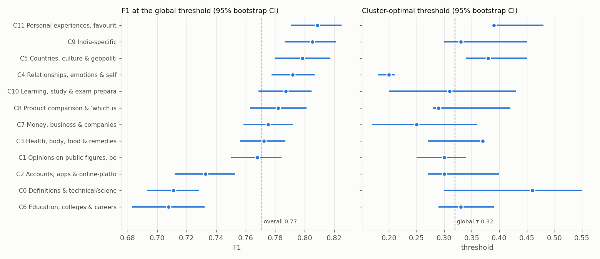
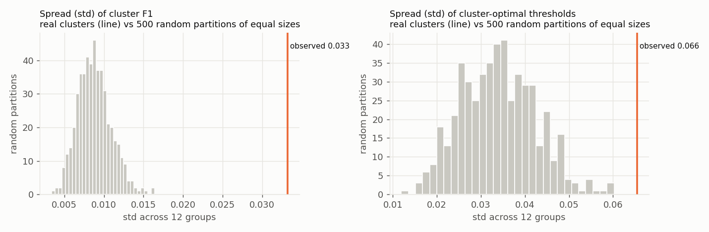
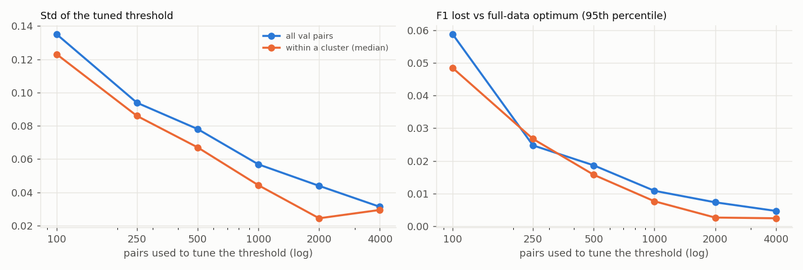
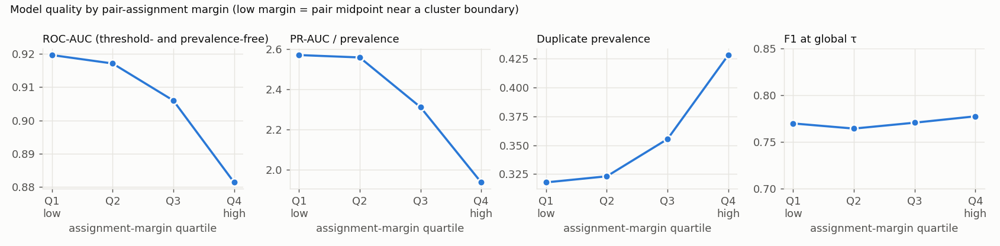

# Phase 5: Cluster-Level Error Analysis

**Question:** do the primary model's performance and its F1-optimal decision threshold differ meaningfully across the 12 semantic regions found in Phase 4?

**Setup:**
- Model: the Phase 3 primary model (frozen MiniLM + MLP head, `sbert_mlp`) with its frozen global threshold **τ = 0.32**.
- Clusters: the **frozen** Phase 4 centroids (not refit; SHA-256 checked).
- Data: **validation only** (38,138 pairs). Nothing was tuned or modified, and no cluster-specific threshold was applied.

**Interpretation rule used throughout:** the 12 clusters are *soft regions of a continuous embedding space* (silhouette ≈ 0.02), not discrete query types.
A pair's "cluster" is a coordinate describing where the pair sits in that space.

Reproduce:
```bash
python scripts/analyze_clusters.py          # rule comparison, per-cluster metrics, bootstrap, null, boundary, error samples
python scripts/threshold_reliability.py     # threshold stability vs. sample size
python scripts/summarize_manual_errors.py   # tabulates artifacts/phase5/manual_error_labels.csv
```
Artifacts: `artifacts/phase5/`. These include `rule_comparison.json`, `cluster_metrics.csv`, `summary.json`, `null_partition.json`, `boundary.json`,
`threshold_reliability.json`, `pair_assignments.csv` (per-pair cluster, margin and outcome), `error_samples.csv`,
`manual_error_labels.csv` and `rule_sensitivity.json`.

## 1. Pair-to-cluster assignment rule

Three rules were compared using **only label-free properties**. The primary rule was fixed in code (`PRIMARY_RULE`) before any per-cluster F1 was computed.

| Property | A. Question-1 cluster | **B. Pair-average embedding** | C. Same-cluster only |
|---|---|---|---|
| Coverage | 100% | **100%** | 67.3% |
| Unchanged when Q1 and Q2 are swapped (symmetry) | **67.3%** | **100%** | 100% |
| Unchanged under small embedding noise (cos ≈ 0.98 to the original) | 97.0% | **97.7%** | 99.95%* |
| Pairs per cluster (min – max) | 2,391 – 4,889 | **2,447 – 4,561** | 1,508 – 3,146 |
| Size entropy (1 = balanced) | 0.990 | **0.993** | 0.989 |
| Median assignment margin | 0.036 | 0.037 | – |
| Agrees with Q1's / Q2's / either question's cluster | – | 82.1% / 82.6% / **97.4%** | – |

\*Rule C looks most robust only because it discards every straddling pair, and 2% of pairs drop out of coverage under the same noise.

**Chosen rule: B (pair-average embedding).**
1. **Symmetry:** Rule A changes the cluster of **a third of all pairs** if the two questions are listed in the other order. A pair has no natural "first" question, so that is unacceptable.
2. **Coverage:** Rule C leaves 32.7% of pairs without a cluster, which would make any later per-cluster rule incomplete. It is kept only as a diagnostic.
3. **Geometry:** B assigns the normalised midpoint of the two embeddings to its nearest frozen centroid, using exactly the rule that defined the clusters.
4. **Interpretability:** in 97.4% of pairs, B's cluster is the cluster of at least one of the two questions. In the remaining 2.6% the midpoint falls in a third region between them.
5. **Stability and balance:** B is the most noise-robust full-coverage rule and the most balanced.

**Assignment margin geometry.** Nearest-centroid assignment (Euclidean, raw centroids) and "highest cosine to a unit centroid" disagree for
5.9% of questions, because centroid norms differ (0.26–0.46). The margin is therefore measured in the assignment geometry itself: the score gap
between the assigned centroid and the runner-up. Phase 4's §6 margin used unit-centroid cosine, a slightly different quantity.

**Sensitivity check, done after the choice and not used for it** (`rule_sensitivity.json`): rule A gives macro F1 0.770, worst cluster C6 at 0.710,
and optimal thresholds 0.20–0.44. Those are the same conclusions as rule B, so the findings below do not depend on the rule.

## 2. Per-cluster metrics (validation, rule B, global τ = 0.32)



| Cluster | n | Duplicate prevalence | Precision | Recall | **F1** [95% CI] | FPR | FNR | ROC-AUC | PR-AUC | PR-AUC ÷ prevalence | Mean score | **Optimal τ** [95% CI] |
|---|---|---|---|---|---|---|---|---|---|---|---|---|
| C0 Definitions & technical concepts | 4,561 | 0.272 | **0.600** | 0.872 | **0.711** [0.693, 0.729] | 0.217 | 0.128 | 0.911 | 0.794 | 2.92 | 0.30 | 0.46 [0.30, 0.55] |
| C1 Opinions on public figures & beliefs | 3,602 | 0.351 | 0.700 | 0.850 | 0.768 [0.750, 0.784] | 0.196 | 0.150 | 0.903 | 0.805 | 2.30 | 0.31 | 0.30 [0.25, 0.34] |
| C2 Accounts, apps & platform how-to | 3,584 | 0.283 | 0.648 | 0.843 | **0.733** [0.712, 0.753] | 0.180 | 0.157 | 0.906 | 0.753 | 2.67 | 0.27 | 0.30 [0.27, 0.40] |
| C3 Health, body & food | 3,608 | 0.395 | 0.689 | 0.878 | 0.772 [0.756, 0.787] | 0.258 | 0.122 | 0.891 | 0.826 | 2.09 | 0.37 | 0.37 [0.27, 0.37] |
| C4 Relationships & emotions | 3,476 | 0.446 | 0.741 | 0.850 | 0.792 [0.777, 0.807] | 0.239 | 0.150 | **0.881** | 0.823 | 1.85 | 0.36 | **0.20 [0.18, 0.21]** |
| C5 Countries & geopolitics | 2,889 | 0.329 | 0.719 | 0.898 | 0.799 [0.780, 0.817] | 0.172 | 0.102 | **0.936** | 0.864 | 2.63 | 0.31 | **0.38 [0.34, 0.45]** |
| C6 Education, colleges & careers | 2,754 | **0.249** | 0.636 | **0.797** | **0.708** [0.683, 0.732] | 0.151 | **0.203** | 0.904 | 0.766 | 3.08 | 0.24 | 0.33 [0.29, 0.39] |
| C7 Money & business | 3,298 | 0.380 | 0.734 | 0.821 | 0.775 [0.758, 0.792] | 0.182 | 0.179 | 0.908 | 0.849 | 2.23 | 0.31 | 0.25 [0.17, 0.36] |
| C8 Product comparison / "which is best" | 2,594 | 0.358 | 0.707 | 0.875 | 0.782 [0.763, 0.801] | 0.202 | 0.125 | 0.914 | 0.835 | 2.34 | 0.34 | 0.29 [0.28, 0.42] |
| C9 India-specific | 2,786 | 0.384 | 0.724 | 0.907 | 0.805 [0.786, 0.821] | 0.216 | 0.093 | 0.920 | 0.853 | 2.22 | 0.37 | 0.33 [0.30, 0.45] |
| C10 Learning & exam preparation | 2,447 | 0.456 | 0.695 | 0.908 | 0.787 [0.769, 0.805] | **0.334** | 0.092 | **0.879** | 0.840 | 1.84 | 0.45 | 0.31 [0.20, 0.43] |
| C11 Personal experiences & favourites | 2,539 | 0.428 | 0.727 | 0.911 | **0.808** [0.791, 0.825] | 0.256 | 0.089 | 0.912 | 0.875 | 2.04 | 0.41 | **0.39 [0.39, 0.48]** |

The CIs come from 1,000 bootstrap resamples within each cluster. The optimal threshold uses the same 0.01 grid as every earlier phase.

## 3. Global robustness metrics

| Metric | Value |
|---|---|
| Overall F1 (global τ = 0.32) | **0.771** |
| Macro cluster F1 | 0.770 |
| Worst-cluster F1 | **0.708** (C6 Education, colleges & careers) |
| Best-cluster F1 | 0.808 (C11 Personal experiences) |
| Cluster F1 range / std | 0.101 / 0.033 |
| Cluster-optimal thresholds: min / median / max | 0.20 / 0.32 / 0.46 |
| Optimal-threshold range / std | 0.26 / 0.066 |

**Is the spread more than chance?** The 12 groups were compared with **500 random partitions of the validation pairs into groups of the same sizes**,
which shows what spread pure sampling noise produces:



| Spread statistic | Real clusters | Random partitions: mean | 95th pct | max | One-sided p |
|---|---|---|---|---|---|
| Std of cluster F1 | **0.033** | 0.009 | 0.012 | 0.016 | < 0.002 |
| Range of cluster ROC-AUC | **0.057** | 0.017 | 0.024 | 0.032 | < 0.002 |
| Std of cluster-optimal thresholds | **0.066** | 0.034 | 0.048 | 0.060 | < 0.002 |
| Range of cluster-optimal thresholds | 0.26 | 0.12 | 0.18 | 0.25 | < 0.002 |

(p < 0.002 means none of the 500 random partitions reached the observed value.)

The semantic regions differ **more than random groups would**: about 3× for F1 spread and ROC-AUC range, about 2× for threshold spread.
Two caveats keep this from being overinterpreted:

1. **F1 differences largely follow prevalence.** Across the 12 clusters, F1 rises with duplicate prevalence (Spearman ρ = 0.69, p = 0.013).
   The three lowest-F1 clusters (C6, C0, C2) are exactly the three with the fewest duplicates (25–28%). F1 is mechanically lower when positives are rarer.
   Their *ranking* quality (ROC-AUC 0.904–0.911) is ordinary, and their PR-AUC lift over chance is the *highest* of all clusters (2.67–3.08).
2. **The clusters that rank worst are different ones.** The lowest ROC-AUC values belong to C10 Learning (0.879), C4 Relationships (0.881)
   and C3 Health (0.891). These are high-prevalence advice-seeking regions where "duplicate" is a loose, subjective judgement.
   ROC-AUC is unrelated to prevalence (ρ = −0.36, p = 0.25).

So "which cluster is weak" depends on the metric, and both senses are reported below.

## 4. Weakest clusters

| Criterion | Weakest three |
|---|---|
| F1 | **C6** Education (0.708), **C0** Definitions (0.711), **C2** Accounts/apps (0.733) |
| Precision | C0 (0.600), C6 (0.636), C2 (0.648) |
| Recall / FNR | C6 (0.797 / 0.203), C7 Money (0.821 / 0.179), C2 (0.843 / 0.157) |
| FPR | C10 Learning (0.334), C3 Health (0.258), C11 Experiences (0.256) |
| ROC-AUC (prevalence-free) | C10 (0.879), C4 Relationships (0.881), C3 (0.891) |
| Mean rank over F1, P, R, FPR, FNR | C6 (3.4), C0 (4.0), C2 (4.4) |

**C6, C0 and C2 are weakest on F1 and precision.** These are low-prevalence, entity-dense regions: colleges, exams, products, platforms,
technical terms. **C10, C4 and C3 are weakest at separating duplicates from non-duplicates**: advice and opinion regions with loose duplicate definitions.

### Automatic tags by cluster (heuristic, for description only)

| Cluster | FPs with an entity diff | FPs with a number diff | FPs with a negation diff | High-overlap FPs (J > 0.6) | Low-overlap FNs (J ≤ 0.2) | FPR on high-overlap negatives |
|---|---|---|---|---|---|---|
| C6 Education | **38.7%** | 12.8% | 3.2% | 34.2% | 12.2% | 40.5% |
| C0 Definitions | 14.0% | 6.1% | 5.0% | **34.3%** | 23.4% | 45.7% |
| C2 Accounts/apps | 23.1% | 11.0% | **10.8%** | 21.6% | 13.8% | 48.3% |
| C9 India | **39.1%** | 10.0% | **11.6%** | 22.6% | 18.2% | 40.2% |
| C5 Countries | 35.9% | 4.8% | 9.9% | 28.1% | 8.2% | **19.4%** |
| C4 Relationships | 3.0% | 2.6% | 11.1% | 27.5% | **29.7%** | **66.5%** |
| C1 Opinions | 29.4% | 10.0% | 10.7% | 22.0% | 17.9% | **67.3%** |
| C3 Health | 6.0% | 9.1% | 5.7% | 21.8% | 24.1% | **65.1%** |

The full 12-cluster table is in `summary.json → tag_rates_by_cluster`. Entity-difference false positives concentrate in the entity-dense regions
(C6, C9, C5, C1). Low-overlap false negatives concentrate in advice regions (C4, C3, C0).

## 5. Manual error categories

From each of the three weakest clusters (C6, C0, C2) and from the nine others pooled, I sampled 15 false positives and 15 false negatives
(seed 42, 120 pairs in total) and read every pair. Each got one primary category (`manual_error_labels.csv`; a single annotator with the model
score visible, so treat the counts as indicative).

**False positives (60):**

| Category | Count | Share | Example |
|---|---|---|---|
| Likely label noise | 16 | **27%** | "…percentile do I need to…" vs "…do I *realistically* need to…" (labelled 0) |
| Broader / narrower scope | 15 | **25%** | "minimum marks in JEE Main to get NIT?" vs "…to get EEE in NIT Calicut with 96% AP board?" |
| Different aspect of the same topic | 9 | 15% | "Who invented zero and how?" vs "Was zero invented or discovered?" |
| Attribute swap | 7 | 12% | "career path for a professor in **structural** engineering" vs "…**mechanical** engineering" |
| Entity mismatch | 6 | 10% | "temperament of a **Doberman**/Lab mix" vs "a Lab/**Pitbull** mix"; Mail.com vs AT&T email |
| Number mismatch | 2 | 3% | "Is 5'3 tall for an 11-year-old?" vs "Is 5'1.5 short…?" |
| Date / time mismatch | 2 | 3% | "notifications per **week**" vs "per **day**"; internship "2017" vs unspecified |
| Negation mismatch | 2 | 3% | "shapes with **no** right angles" vs "shapes with **4** right angles"; scan "**without** a scanner" |
| Context-dependent reference | 1 | 2% | "What does **this** Arabic text mean?", which refers to different texts |
| Location mismatch | 0 | 0% | none sampled (location differences appeared, e.g. Dubai, but not as the primary error) |

- **Explicit constraint mismatches** (entity, number, date, negation, location) make up **20%** of sampled false positives, and **32%** if attribute swaps are included.
- **27% look mislabelled.** This is concentrated in C6, where 7 of 15 sampled false positives are near-identical pairs labelled 0.

**False negatives (60):**

| Category | Count | Share | Example |
|---|---|---|---|
| Paraphrase with low lexical overlap | 34 | **57%** | "Are the orbits synchronized on the same plane?" vs "Are the orbits of each planet coplanar?"; "LEO" vs "police officers" |
| Broader / narrower (labelled duplicate anyway) | 15 | 25% | "How do I get a free iPhone?" vs "How do I get a free iPhone 7?" |
| Debatable topical merge | 9 | 15% | "How do I join the army after hotel management?" vs "How do I join IAF after MBBS?" (6 of 9 in C6) |
| Likely label noise | 2 | 3% | "ISI" vs "RBI selection process" labelled duplicate |

### Error types dominating the weak clusters

- **C6 Education & careers (lowest F1).** False positives: label noise (7/15) and broader/narrower scope (4/15).
  False negatives: debatable topical merges (6/15) and paraphrases (6/15). Quora's labels in this region are least consistent:
  near-identical questions are marked different, while "army after hotel management" and "IAF after MBBS" are merged. A large part of C6's low F1 is
  **label inconsistency combined with low prevalence**, not a model blind spot.
- **C0 Definitions & technical concepts (lowest precision).** False positives: scope (4), different aspect (3), entity mismatches such as dog breeds
  and "Zero Gravity club" vs "zero gravity" (3), and label noise (3). False negatives: paraphrases (10/15) such as "coplanar", "collapsed answers" and "cloud computing".
- **C2 Accounts, apps & platforms.** False positives: scope (4), different aspect (3), attribute swaps (2: "4G dongle vs 3G phone",
  "question vs answer"), and entity (2: Mail.com vs AT&T). False negatives: paraphrases (10/15).

## 6. Threshold variation

| | |
|---|---|
| Global threshold (Phase 3) | 0.32 |
| Cluster-optimal thresholds | 0.20 (C4) to 0.46 (C0); median 0.32 |
| **Prefer higher thresholds** (be stricter) | **C0** Definitions 0.46, **C11** Experiences 0.39, **C5** Countries 0.38, **C3** Health 0.37 |
| **Prefer lower thresholds** (be more lenient) | **C4** Relationships 0.20, **C7** Money 0.25 |
| 95% CI excludes the global 0.32 | **C4** [0.18, 0.21], **C5** [0.34, 0.45], **C11** [0.39, 0.48]; 9 of 12 clusters include 0.32 |

**Are the differences material?** Mostly not in F1 terms:
- Each cluster's F1-vs-threshold curve has a **wide plateau**. For 11 of 12 clusters, the band of thresholds within 0.01 F1 of that cluster's optimum
  *contains* 0.32 (e.g. C0: 0.30–0.56). Only **C4**'s plateau (0.13–0.26) excludes it.
- The **in-sample F1 headroom** from using each cluster's own optimum is ≤ 0.004 for 8 clusters, and 0.006–0.014 for C0, C5, C11 and C4. Overall it
  is **+0.006 F1**. This figure is an **optimistic upper bound**: thresholds tuned and scored on the same pairs. It is not a Phase 7 result.
- **The worst cluster cannot be fixed by a threshold.** C6's optimum is 0.33, essentially the global value, with a headroom of +0.002.

**Stable or noise?** Partly both:
- The *spread* of optimal thresholds exceeds every random partition (std 0.066 vs a null maximum of 0.060), so it is not purely noise.
- But a threshold tuned on n pairs is itself noisy (`threshold_reliability.py`, 300 subsamples per size):

  

  | Pairs used to tune | Threshold std (all val) | Mean F1 lost vs full-data optimum | 95th pct F1 lost |
  |---|---|---|---|
  | 100 | 0.135 | 0.016 | 0.059 |
  | 250 | 0.094 | 0.008 | 0.025 |
  | 500 | 0.078 | 0.006 | 0.019 |
  | 1,000 | 0.057 | 0.003 | 0.011 |
  | 2,000 | 0.044 | 0.002 | 0.007 |
  | 4,000 | 0.031 | 0.001 | 0.005 |

  At this dataset's cluster sizes (2,447–4,561 pairs), estimation noise is about 0.03–0.045, roughly half the observed between-cluster std of 0.066.
  The bootstrap CIs agree: thresholds for C0, C7, C8, C9 and C10 move by ±0.05–0.06 under resampling.

**Does cluster size affect reliability?** Yes, strongly, but not visibly *among* these 12 clusters: their sizes only span 2.4k–4.6k, and the CI width
correlates weakly with n (r = 0.16). The subsampling experiment shows the size effect directly. **Below about 500 pairs, threshold noise (std ≥ 0.08) is as large
as the whole observed between-cluster spread**, so a per-cluster threshold estimated from a few hundred pairs would mostly fit noise.
The within-cluster curve flattens from n = 2,000 partly because those subsamples overlap heavily with the finite cluster, which understates the variance.

## 7. Boundary sensitivity (diagnostic)

Each validation pair's assignment margin and its cosine to the assigned centroid are stored in `pair_assignments.csv`.



| Assignment-margin quartile | n | Prevalence | ROC-AUC | PR-AUC ÷ prevalence | F1 at τ | FPR | FNR |
|---|---|---|---|---|---|---|---|
| Q1 (near a boundary, margin < 0.016) | 9,535 | 0.318 | **0.920** | 2.57 | 0.770 | 0.186 | 0.124 |
| Q2 | 9,534 | 0.323 | 0.917 | 2.56 | 0.764 | 0.202 | 0.119 |
| Q3 | 9,534 | 0.355 | 0.906 | 2.31 | 0.771 | 0.216 | 0.127 |
| Q4 (deep inside a region, margin > 0.064) | 9,535 | 0.428 | **0.881** | 1.94 | 0.778 | 0.251 | 0.151 |

| Pair type | n | Prevalence | ROC-AUC | F1 at τ | FPR | FNR |
|---|---|---|---|---|---|---|
| Both questions in the same cluster | 25,683 | 0.442 | 0.879 | 0.783 | 0.294 | 0.118 |
| Questions in different clusters ("straddling") | 12,455 | 0.178 | **0.941** | 0.712 | 0.097 | 0.200 |

**Low-confidence assignments are *not* worse.** Pairs near a boundary are ranked slightly *better* (ROC 0.92 vs 0.88), and F1 is flat across quartiles
(0.764–0.778). The pattern runs the other way. Pairs deep inside a region, and pairs whose two questions share a cluster, are topically close, more often
duplicates, and harder to separate. Straddling pairs are mostly easy negatives about different topics. So boundary softness is **not** a performance
problem for the primary model. It does mean a pair's cluster partly encodes how topically similar its two questions are, which is information the model already has.

## 8. Implications for Phase 6 (entity / constraint features)

- **Supported, but with a bounded target.** Explicit constraint mismatches are **20%** of sampled false positives, or **32%** including attribute swaps.
  They concentrate in the entity-dense regions: entity-difference false positives are 36–39% of all false positives in C5, C6 and C9.
  Phase 3 already showed the model accepts 47% of high-overlap number mismatches and 72% of negation mismatches.
- **Specificity (broader/narrower) is as common as constraint mismatch** (25% of false positives). The Phase 6 "specificity proxies" (length
  difference, extra-token counts) address a *larger* error class than entities alone. The same scope differences also appear among *positives*
  (25% of false negatives are labelled duplicates despite a scope difference), so a scope feature will not be one-directional.
- **About 27% of false positives (and most of C6's) look mislabelled.** That is a ceiling no feature can lift. Phase 6 gains should be judged
  against it, and per-cluster gains in C6 will be capped.
- **Low-overlap paraphrase false negatives (57%) are not addressed by constraint features at all.**
- Expect Phase 6 to help precision in C0, C2, C5, C6 and C9 more than elsewhere. Check worst-cluster F1 specifically, not only overall F1.

## 9. Implications for Phase 7 (cluster-specific calibration)

- **The hypothesis remains testable, but the prior expectation is a small effect.** Thresholds do vary beyond chance, but the F1 curves are flat
  near their optima. The total in-sample headroom is +0.006 F1, and the worst cluster (C6) has none.
- Thresholds can only help where a cluster's plateau excludes the global τ. That is clearly true for **C4** only, with C5 and C11 borderline.
  Gains, if any, are more likely in macro-cluster F1 than in worst-cluster F1.
- **Minimum-size rule:** per the reliability experiment, a cluster needs ≥ 1,000 validation pairs (threshold std about 0.05, mean regret ≤ 0.003) for its
  own threshold. All 12 clusters qualify (≥ 2,447), so the global fallback would not trigger here, but it must exist for a different K or smaller data.
- Phase 7 must estimate cluster thresholds on validation and evaluate them out of sample (cross-fitting within validation, then the frozen test set),
  because in-sample gains of this size are within estimation noise.

## 10. Limitations caused by weak cluster separation

1. **Clusters are regions, not types.** With silhouette about 0.02, cluster membership is a coarse coordinate; a different K or seed would move some pairs
   (Phase 4 stability ARI about 0.8). Per-cluster numbers describe *regions of this embedding*, not stable question categories.
2. **Clusters are partly confounded with pair difficulty.** Same-region pairs are harder (ROC 0.88) than straddling pairs (0.94), and prevalence varies
   from 25% to 46% across clusters. Some of what looks like "cluster behaviour" is prevalence and topical closeness.
3. **Prevalence shifts F1 mechanically.** Cross-cluster F1 comparisons are partly comparisons of base rates. ROC-AUC and PR-AUC lift are reported alongside for that reason.
4. Two clusters (C0, C1) are broad catch-alls, so their averages mix heterogeneous questions.
5. The manual categories come from one annotator on a 120-pair sample with model scores visible: indicative proportions, not precise rates.
6. All numbers are on validation, the same data used to choose the global threshold. The cross-half check in Phase 3 bounds that optimism at ≤ 0.002 F1.

## Answers

1. **Does performance differ meaningfully across clusters?** **Yes, moderately.** Cluster F1 spans 0.708–0.808 (std 0.033, against 0.009 for random groups),
   and ROC-AUC spans 0.879–0.936 (3× the random-partition range). But much of the F1 spread tracks duplicate prevalence (ρ = 0.69). The low-F1 regions
   (C6, C0, C2) rank pairs normally; the poorly-ranking regions are different ones (C10, C4, C3, the advice-seeking areas).
2. **Do optimal thresholds differ meaningfully across clusters?** **Statistically yes, practically only a little.** Optima range 0.20–0.46, and the spread
   exceeds all 500 random partitions. But only 3 of 12 clusters have CIs excluding the global 0.32 (C4 lower; C5 and C11 higher), F1 plateaus are wide,
   and the total in-sample headroom is +0.006 F1. About half the observed spread is the estimation noise expected at these cluster sizes.
3. **Which error types dominate weak clusters?**
   - *C6:* label noise and debatable topical merges, alongside scope differences.
   - *C0 and C2:* scope (broader/narrower), different-aspect pairs, entity and attribute swaps among false positives; low-overlap paraphrases among false negatives.
   - *All clusters:* paraphrase false negatives dominate missed duplicates (57%).
4. **Is there enough evidence to justify Phase 6 entity/constraint features?** **Yes, with a bounded target.** Constraint mismatches are 20–32% of
   sampled false positives, concentrated in entity-dense regions, and Phase 3 measured large failure rates on number and negation mismatches. Specificity
   is an equally large false-positive class and should be included. Expect gains capped by about 27% label noise among false positives.
5. **Is there enough evidence to justify Phase 7 cluster-specific calibration?** **Enough to test it, not enough to expect much.** It is the project's
   central hypothesis and the threshold spread is beyond chance, so it should be tested properly. The prior from this phase, though, is a small overall effect
   (headroom about +0.006 F1 in-sample), a possible gain mainly in C4, and no help for the worst cluster. A null or negative Phase 7 result would be
   consistent with this analysis and should be reported as such.
