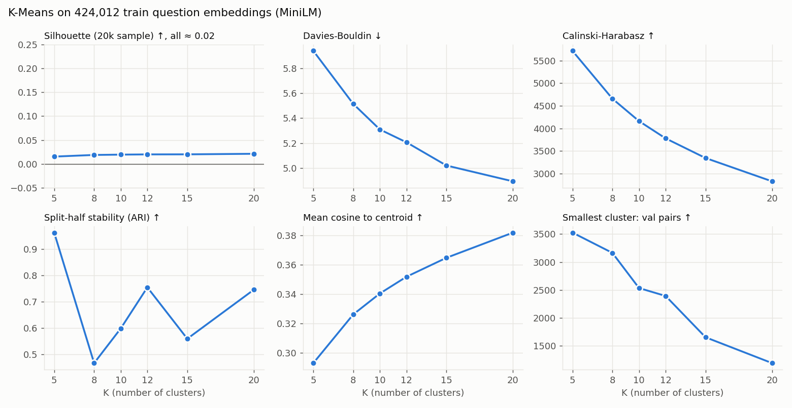
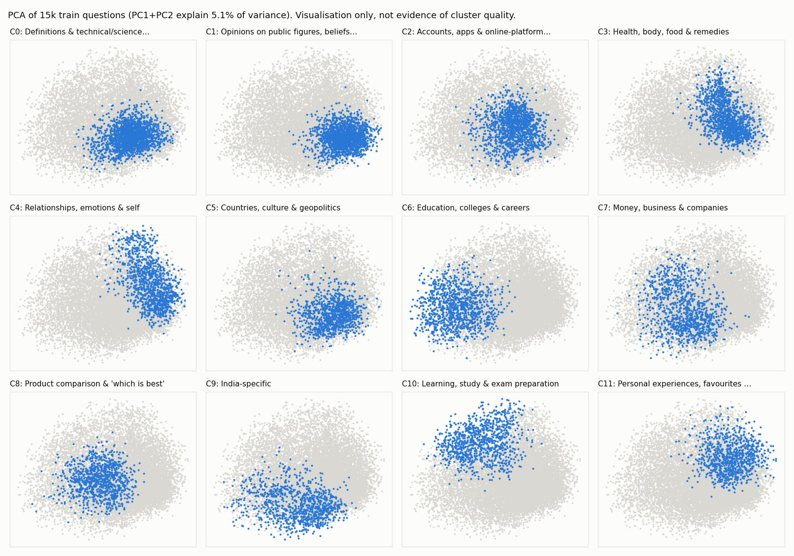

# Phase 4: Unsupervised Query Clustering

**Goal:** discover semantic query groups automatically from sentence embeddings. Interpretation comes only after the groups are formed.

**Result:** K-Means with **K = 12** on the train-question MiniLM embeddings. It produces 12 stable, balanced, mostly interpretable groups.
They are **reproducible regions of a continuous embedding space, not separated islands**: silhouette ≈ 0.02 at every K, and density-based HDBSCAN
finds no usable structure. Phases 5–7 should treat cluster boundaries as soft.

Reproduce:
```bash
python scripts/compare_clustering.py      # K sweep (~30 min CPU) + HDBSCAN grid
python scripts/stability_recheck.py --k 5 8 10 12 15 20   # robust stability (~1 h CPU)
python scripts/build_clusters.py          # loads the frozen centroids (use --refit to re-fit deliberately)
```
Configuration: [configs/clustering.yaml](../configs/clustering.yaml). Artifacts: `artifacts/phase4/` (`k_sweep.json`,
`stability_recheck.json`, `hdbscan.json`, `cluster_model/`, `cluster_descriptions.json`, `cluster_names.json`).
Per-question assignments: `data/processed/clusters/{train,val}_question_clusters.csv`.

## 1. Data and rules

| | |
|---|---|
| Input | `all-MiniLM-L6-v2` embeddings (the Phase 3 primary encoder) of the **424,012 unique train questions**: 384 dimensions, L2-normalised |
| Unit clustered | unique question. A question reused in 157 pairs counts once, so popular questions don't pull the centroids. |
| Labels used | **none.** No duplicate label was used to fit, choose K or interpret. Validation questions were only *assigned* (unlabelled) to check cluster sizes. Choosing K by downstream F1 would have biased the Phase 7 threshold comparison. |
| Test split | never read |
| Geometry | the vectors are unit-length, so Euclidean K-Means partitions by cosine similarity |
| Categories | **no manually defined bins.** Names in §5 were written after reading each cluster. |

## 2. K-Means: comparing K ∈ {5, 8, 10, 12, 15, 20}

Each K was fit with 5 restarts on all 424,012 questions (`scripts/compare_clustering.py`).



| K | Silhouette (20k sample) | Davies-Bouldin ↓ | Calinski-Harabasz ↑ | Mean cos to centroid ↑ | Largest / smallest cluster | Size entropy (1 = balanced) | Val pairs in smallest cluster* |
|---|---|---|---|---|---|---|---|
| 5 | 0.015 | 5.94 | 5,716 | 0.293 | 40.1% / 8.7% (4.6×) | 0.917 | 3,527 |
| 8 | 0.019 | 5.51 | 4,659 | 0.326 | 17.7% / 7.8% (2.3×) | 0.983 | 3,164 |
| 10 | 0.020 | 5.31 | 4,163 | 0.340 | 16.1% / 7.1% (2.3×) | 0.983 | 2,534 |
| **12** | **0.020** | **5.21** | **3,781** | **0.352** | **13.4% / 6.4% (2.1×)** | **0.989** | **2,392** |
| 15 | 0.020 | 5.02 | 3,347 | 0.365 | 13.0% / 4.8% (2.7×) | 0.985 | 1,652 |
| 20 | 0.021 | 4.89 | 2,831 | 0.382 | 10.5% / 3.3% (3.2×) | 0.985 | 1,189 |

\*Validation pairs assigned by the cluster of question 1. This is a sizing guide only; the pair-to-cluster rule is chosen in Phase 5.

What these numbers say, and don't say:
- **Silhouette is about 0.02 for every K.** A silhouette near 0 means points are about as close to the neighbouring cluster as to their own.
  The questions do not form separated groups in embedding space; any K-Means partition cuts a continuum.
- **Davies-Bouldin, coherence and Calinski-Harabasz are monotone in K.** The first two always improve with more clusters, and CH always gets worse.
  None has an elbow, so **none can choose K alone**. Using any one of them would simply pick an endpoint of the grid.
- Size balance peaks at K = 12 (entropy 0.989, largest/smallest only 2.1×). K = 5 has one 40% cluster.
- The smallest cluster's validation support shrinks steadily with K: about 2,400 pairs at K = 12 and about 1,200 at K = 20.

## 3. Stability decides K

Stability asks whether the partition reflects the data or the particular sample and initialisation. It was measured with the adjusted Rand index
(ARI: 1 = identical partitions, 0 = chance agreement) in two ways:
- **Seed ARI:** pairwise ARI between full-data fits with different seeds.
- **Split-half ARI:** fit on two disjoint random halves of train, label a common held-out sample of 50k questions with both, and compare.

**The single estimates in the sweep turned out to be unreliable.** K = 5 scored 0.96 / 1.00, K = 8 scored 0.47 / 0.98, and the values jumped
non-monotonically. So stability was re-measured with **4 seeds (6 pairwise ARIs) and 3 independent split-half draws per K**
(`scripts/stability_recheck.py`):

| K | Seed ARI: mean [min, max] | Split-half ARI: mean [min, max] | Average |
|---|---|---|---|
| 5 | 0.52 [0.37, 1.00] | 0.65 [0.47, 0.95] | 0.58 |
| 8 | 0.65 [0.57, 0.99] | **0.86** [0.69, 0.95] | 0.76 |
| 10 | 0.66 [0.49, 1.00] | 0.72 [0.67, 0.78] | 0.69 |
| **12** | **0.79** [0.70, 0.99] | 0.80 [0.72, 0.94] | **0.80** |
| 15 | 0.72 [0.59, 0.82] | 0.70 [0.66, 0.77] | 0.71 |
| 20 | 0.67 [0.60, 0.78] | 0.70 [0.59, 0.81] | 0.68 |

The robust estimates reverse the sweep's conclusions about K = 5, which looked perfectly stable and is the *least* stable.
Note the wide [min, max] ranges: in a continuum there are several near-equally good partitions, and which one a run finds depends on initialisation.

## 4. HDBSCAN

HDBSCAN is density-based and does not need K, so it was the natural alternative. It is roughly quadratic in high dimensions, so it ran on a
random **30,000-question sample** after PCA, over 5 settings from coarse to fine (`artifacts/phase4/hdbscan.json`):

| PCA dims | min_cluster_size | min_samples | Clusters | Noise | Largest cluster | Median cluster size | Time |
|---|---|---|---|---|---|---|---|
| 50 | 200 | 10 | **0** | **100%** | – | – | 228 s |
| 50 | 50 | 10 | 2 | 82.7% | 17.1% | 2,594 | 209 s |
| 50 | 15 | 5 | 5 | 40.5% | **59.2%** | 22 | 208 s |
| 10 | 50 | 10 | 4 | 62.3% | 37.1% | 65 | 15 s |
| 10 | 15 | 5 | 3 | 32.4% | **67.5%** | 23 | 14 s |

Across every setting, HDBSCAN either declares most questions noise, or finds **one dominant blob plus a few crumbs of about 20 questions**.
That is consistent with the silhouette result: there are no density gaps to find. For this project it is also unusable in principle, because
every validation pair must belong to a group for per-group thresholds, and 32–100% noise would leave those pairs unassigned.
**HDBSCAN is rejected for a measured reason, not by default.**

## 5. Selected model: K-Means, K = 12

**Why K = 12** (no single metric decided it):
1. **Most stable:** the highest mean seed ARI (0.79) and the best seed/split-half average (0.80) of all K tested.
2. **Most balanced:** cluster sizes range from 6.4% to 13.4% of questions (2.1×).
3. **Semantically coherent on inspection:** 10 of 12 clusters have a clear theme (below); 2 are broad.
4. **Enough data per cluster for Phase 7:** 2,391–4,889 validation pairs per cluster (by question-1 cluster), so per-cluster thresholds can be estimated without most clusters needing the global fallback.
5. Davies-Bouldin and coherence are better at K = 15–20, but only as the mechanical effect of more clusters, and at the cost of lower stability and thinner validation support.

**Final fit:** 10 restarts, seed 42. Cluster ids are ordered by size (C0 largest). The model is stored as **centroids only**
(`artifacts/phase4/cluster_model/centroids.npy`, 12 × 384, SHA-256 recorded and tested). Any question, including validation, test and demo input,
is assigned to its nearest centroid. That rule exactly reproduces the K-Means labels and is deterministic.

**Freezing:** K-Means refits are *not* bit-reproducible. Two refits with identical seed and settings agreed at ARI 0.9997, but moved a few dozen
boundary questions, because multithreaded float32 reductions change the summation order. So, like the data split, the **frozen centroids are the
source of truth**: `build_clusters.py` loads them and refits only with an explicit `--refit`.

### Clusters (named after inspection)

Names were written after reading the top class-based TF-IDF terms, the 10 questions nearest each centroid, and random members
(`artifacts/phase4/cluster_descriptions.json`, `cluster_names.json`). They describe groups in *this* dataset; they are not universal question types.

| Cluster | Train questions | Val questions | Coherence (mean cos) | Distinctive terms | Name (post hoc) | Typical questions |
|---|---|---|---|---|---|---|
| C0 | 56,739 (13.4%) | 7,056 (13.2%) | 0.288 | mean, used, meaning, word, examples, differences, function | **Definitions & technical/science concepts** (broad) | "What does IT stand for?", "When to use a capacitor in a circuit?", "What does burning butane produce?" |
| C1 | 47,267 (11.1%) | 5,862 (10.9%) | 0.280 | trump, hillary, president, happen, god, earth, believe | **Opinions on public figures, beliefs & speculation** (broad) | "Does Stephen Hawking believe in God?", "What would you do if Donald Trump showed up on your doorstep?" |
| C2 | 40,759 (9.6%) | 5,494 (10.2%) | 0.257 | phone, account, facebook, iphone, quora, google, instagram | **Accounts, apps & online-platform how-to** | "How do you set up a … account?", "How do you track a cell phone for free?" |
| C3 | 35,453 (8.4%) | 4,696 (8.8%) | 0.318 | eat, weight, hair, lose, body, food, sleep | **Health, body, food & remedies** | "How can I lose 5 kg in 15 days?", "How do you suppress hunger?" |
| C4 | 34,030 (8.0%) | 4,287 (8.0%) | 0.348 | love, girl, feel, girlfriend, relationship, life | **Relationships, emotions & self** | "How do you overcome emotional attachment?", "How can I truly find happiness?" |
| C5 | 32,126 (7.6%) | 4,117 (7.7%) | 0.347 | world, country, war, china, america, compare | **Countries, culture & geopolitics** | "What do Australians think of China?", "Which religion is followed in Japan?" |
| C6 | 31,941 (7.5%) | 4,002 (7.5%) | **0.462** | engineering, university, job, college, mba, degree | **Education, colleges & careers** | "How is the education in tier 3 engineering college in India?" |
| C7 | 31,070 (7.3%) | 4,110 (7.7%) | 0.394 | money, business, company, earn, startup, invest | **Money, business & companies** | "How does Invesco make money?", "How should I start a wholesale business at 16?" |
| C8 | 29,834 (7.0%) | 3,498 (6.5%) | 0.382 | buy, better, android, laptop, software, mobile | **Product comparison & "which is best"** | "What is the best smartphone in the market?", "Is Swift slower than Java?" |
| C9 | 29,697 (7.0%) | 3,768 (7.0%) | **0.461** | india, indian, pakistan, delhi, bollywood, modi | **India-specific** | "How is India viewed outside India?", "Which places should I visit in Jaipur?" |
| C10 | 28,157 (6.6%) | 3,414 (6.4%) | 0.422 | learn, prepare, books, study, tips, exam, skills | **Learning, study & exam preparation** | "What are some tips for self study?", "How do I learn C++ if I only know Java?" |
| C11 | 26,939 (6.4%) | 3,306 (6.2%) | 0.407 | favorite, life, you've, movies, songs, worst | **Personal experiences, favourites & stories** | "What is the weirdest thing you've seen?", "What movie can you relate to the most?" |



*PCA is used for visualisation only. PC1 and PC2 explain just 5.1% of the variance, and the apparent regions in 2-D are not evidence of cluster quality.*

**Observations:**
- The groups mix **topic** (health, India, countries, money) with **intent** (definitional C0, recommendation/comparison C8, how-to C2 and C10,
  experiential/opinion C11 and C1). That echoes the kinds of groups the project expected, but emerged without being defined.
- **Validation question shares match train within ±0.6 points for every cluster**, so the clusters transfer to unseen questions.
- The two lowest-coherence clusters (C0 and C1, both about 0.28) are the broadest catch-alls. Random members of C1 range from smartphones to
  Theodor Herzl's flag. If Phase 5 shows these clusters behave differently, it is a property of a heterogeneous group, not of one question type.
- **Some misplacements are visible**, e.g. "How do I use 'best regards' in English?" in C2 (apps/accounts) and a grammar question in C5. Clusters
  follow surface topic words more than intent when the two conflict.

## 6. Boundary softness

| Measure | Value |
|---|---|
| Median cosine gap between a question's nearest and second-nearest centroid | 0.095 |
| Questions with a gap < 0.02 (essentially on a boundary) | **13.0%** |
| Questions with a gap < 0.05 | 29.5% |
| Validation pairs whose two questions fall in the **same** cluster | **67.3%** |

**A third of validation pairs straddle two clusters.** This matters directly for Phase 5, which must choose how to assign a *pair* to a cluster
(question-1 cluster, pair-average embedding, or shared cluster only). The "shared cluster" option would cover only two-thirds of pairs.

## 7. Limitations

1. **No strong cluster structure exists** (silhouette ≈ 0.02; HDBSCAN finds none). K-Means imposes a partition on a continuum. The clusters are
   useful, reproducible *regions*, but a different K or initialisation would draw some boundaries differently (seed ARI 0.70–0.99 at K = 12).
2. **Stability is moderate, not high.** An ARI of about 0.8 means most, not all, of the grouping is reproducible.
3. Clusters reflect **MiniLM's notion of similarity**, which is mostly topical, and an encoder pretrained partly on Quora (Phase 3 §5). Another encoder would give other groups.
4. **Names are subjective summaries** of heterogeneous groups, especially C0 and C1. They are labels for discussion, not ground truth, and not universal question types.
5. HDBSCAN was evaluated on a 30k sample in PCA space (not on the full 384-dimensional data) for computational reasons.
6. Silhouette is estimated on a 20k sample; Davies-Bouldin and Calinski-Harabasz use all 424k questions.
7. The K grid was fixed in advance (5–20). K between the grid points was not explored.

## 8. Hand-off to Phase 5

- Cluster model: `artifacts/phase4/cluster_model/centroids.npy`; assign with `CentroidModel.load(...).predict(embeddings)`.
- Validation question assignments: `data/processed/clusters/val_question_clusters.csv`.
- Scores to analyse: `sbert_mlp` (Phase 3 primary), global τ = 0.32.
- Choose the pair-to-cluster rule with §6 in mind (about 1/3 of pairs straddle clusters), and expect the broad clusters C0 and C1 to behave heterogeneously.
