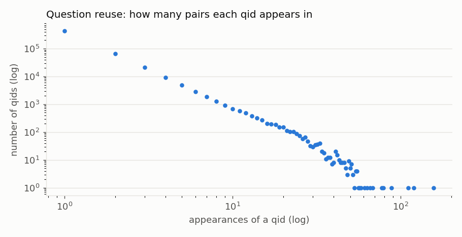
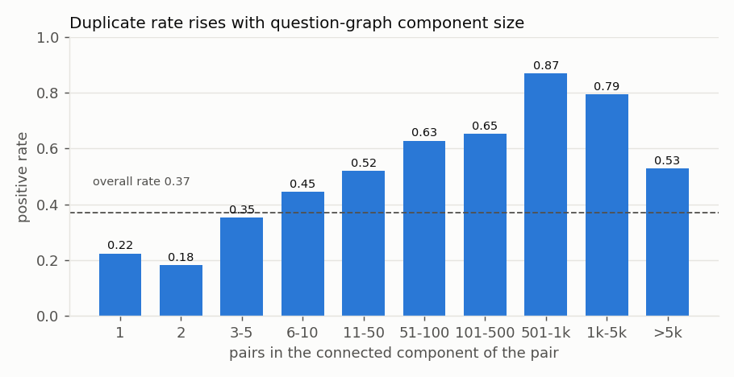
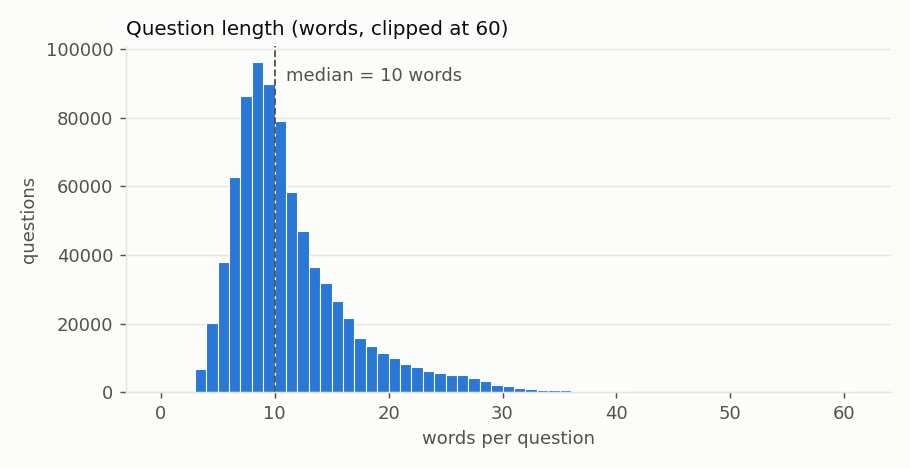

# Data Audit

Reproduce with `python scripts/audit_dataset.py`. It writes all numbers below to `artifacts/phase1/audit_stats.json`
and the examples to `artifacts/phase1/audit_examples.json`. The raw files are only read.

## 1. Files supplied

The repository contained a single archive, `quora-question-pairs.zip` (Kaggle "Quora Question Pairs"):

| Member | Content | Labelled? | Used? |
|---|---|---|---|
| `train.csv.zip` → `train.csv` (63.4 MB) | 404,290 pairs: `id, qid1, qid2, question1, question2, is_duplicate` | **yes** | **yes: the only source of train/val/test** |
| `test.csv` (314 MB) | 2,345,796 pairs: `test_id, question1, question2` | no | no |
| `test.csv.zip` → `test.csv` (478 MB) | 3,563,475 rows but ids only reach 2,345,795, so it contains malformed or extra rows; a different file from the loose `test.csv` | no | no |
| `sample_submission.csv.zip` | `test_id, is_duplicate`, all values = 1 | n/a | no |

The Kaggle test set is unlabelled. Its first rows also show injected filler words
("How does the Surface Pro **himself** 4 compare…", "What **but** is the best way…"), which is consistent with
Kaggle's anti-cheating padding. It cannot be used for evaluation. All evaluation data comes from `train.csv`.

The archive was extracted to `data/raw/` without modification. SHA-256 of `data/raw/train.csv`:
`5f28dbe0bb01b39a793f36567d18fe7cf34d20bbca69ff85b131d7c2186f9914`.

## 2. Structure

| Column | dtype | Missing | Notes |
|---|---|---|---|
| `id` | int64 | 0 | unique, 0…404289 |
| `qid1`, `qid2` | int64 | 0 | 537,933 unique qids; a qid always maps to one text |
| `question1` | object | 0 | one value is the literal placeholder `n/a` |
| `question2` | object | 2 | two empty strings |
| `is_duplicate` | int64 | 0 | values {0, 1} |

**Parsing trap:** with pandas defaults, `n/a` is silently converted to NaN (3 "missing" instead of 2).
The loader uses `keep_default_na=False, na_values=[""]`, so that only truly empty cells are missing and
text such as "NA" or "null" is kept verbatim.

**Rows excluded from all splits (3):** id 105780 and id 201841 (empty `question2`), and id 363362 (`question1 = "n/a"`).
All three are labelled 0.

## 3. Integrity checks

| Check | Result |
|---|---|
| Duplicate rows (all columns / excluding id) | 0 / 0 |
| Duplicate ids | 0 |
| Same unordered qid pair twice (A,B and B,A) | 0 |
| Same unordered pair by *normalised text* | 539 (the same texts posted under different qids) |
| …of which carry conflicting labels | 10 |
| Self-pairs (qid1 == qid2) | 0 |
| Pairs with identical text after lowercase + whitespace normalisation | 37 (32 labelled 1, **5 labelled 0**) |
| Normalised texts appearing under > 1 qid | 715 |

The 5 identical-text negatives differ only by a trailing space. They are context-dependent questions
("Who is this?", "How would you rephrase this sentence?", "What does my birth chart say about me?").
Their referent differs between posts, so the 0 label is arguably correct in intent but unrecoverable from text.
Together with the 10 conflicting repeats, this puts a small floor of label noise under any model.

## 4. Label distribution

| is_duplicate | Pairs | Share |
|---|---|---|
| 0 | 255,027 | 63.1% |
| 1 | 149,263 | **36.9%** |

The data is moderately imbalanced. Predicting all zeros gives 63% accuracy and F1 = 0, which is why accuracy is not a primary metric.

## 5. Question reuse

| Statistic | Value |
|---|---|
| Question slots (2 × pairs) | 808,580 |
| Unique qids / raw texts / normalised texts | 537,933 / 537,362 / 537,151 |
| qids appearing in > 1 pair | 111,780 (20.8%) |
| Pairs containing a reused question | **61.3%** |
| Appearances per qid: median / p90 / p99 / p99.9 / max | 1 / 2 / 9 / 26 / **157** |

Most reused questions: "What are the best ways to lose weight?" (157 pairs), "How can you look at
someone's private Instagram account without following them?" (120), "How can I lose weight quickly?" (111),
"What's the easiest way to make money online?" (88), "Can you see who views your Instagram?" (79).

### Frequency is a label shortcut

Treating pairs as edges, the positive rate climbs steeply with the size of the pair's connected component:

Maximum question frequency alone, with no text at all, reaches **ROC-AUC 0.698**. This reflects how
Quora sampled pairs: popular questions were paired with their known duplicates. It is not a property of intent.
It motivates both the question-disjoint split ([split_strategy.md](split_strategy.md)) and the ban on
frequency and graph features ([problem_definition.md](problem_definition.md)).

## 6. Question length

| | mean | median | min | p1 | p99 | max |
|---|---|---|---|---|---|---|
| characters | 59.8 | 51 | 0 | 19 | 157 | 1,169 |
| words (whitespace) | 11.1 | 10 | 0 | 4 | 31 | 237 |

- 110 questions are under 10 characters, e.g. `?`, `o`, `H`, `.`, `Q?`. They are noise but kept (except the 3 excluded rows).
- 33 questions are over 500 characters. They are multi-sentence personal narratives. The longest (1,169 chars)
  appears 3 times. This long tail matters for sequence-model truncation in Phase 3; p99 is 31 words.
- Median absolute word-count difference within a pair is 2 for duplicates and 3 for non-duplicates. Length difference is a weak signal.

## 7. Text / encoding issues (over 808,580 question slots)

| Issue | Count | Treatment |
|---|---|---|
| Non-ASCII characters (accents, curly quotes, CJK, emoji) | 9,612 | keep; the file decodes cleanly as UTF-8 |
| Mojibake patterns (`Ã`, `â€`) | 0 | none needed |
| HTML entities | 0 | none needed |
| `[math]` LaTeX tags | 949 | keep for now; revisit in Phase 2 preprocessing |
| URLs | 294 | keep |
| Embedded newlines | 11 | whitespace-normalise at preprocessing time |
| No letters at all | 30 | keep; noise |
| No question mark | 1,020 | keep |
| More than one `?` (multi-question posts) | 41,863 | keep. These often cause "broader vs narrower" mismatches. |

## 8. Representative examples

All examples come from `artifacts/phase1/audit_examples.json` (seed 42).

**Duplicates**
- "How do I deal with extreme Social anxiety disorder?" / "How do I deal with my social anxiety?"
- "What is the best first car?" / "What would be a good first car?"
- "How did J.K. Rowling got to supervise the movies?" / "What was J.K. Rowling's involvement in the Harry Potter movies?"

**Non-duplicates**
- "How can I convince my parents to take me to the doctor?" / "How could I convince my parents to take me to Japan?"
- "What is the meaning of "for your reference"?" / "What is the meaning of everything that we do?"

**Difficult positives: low word overlap (9,645 positives have word Jaccard < 0.2)**
- "Is it possible to hack fb?" / "How do we hack a Facebook account?" (abbreviation vs entity name)
- "How can human activities have an effect on biodiversity?" / "What are the common human threats to biodiversity?"
- "Which is the best Alternative Rock band and Why?" / "What are some alternative rock bands?" (label is arguably generous)
- "How can you lose 40 pounds in 30 days?" / "Why is losing 40 pounds in a week an unrealistic goal?" (**label noise**: different time constraint, labelled 1)

**Difficult negatives: high word overlap (13,454 negatives have word Jaccard > 0.8)**
- "…if **Austria** had won the War of Spanish Succession?" / "…if **France** had won…" (entity)
- "examples of **non-movable** joints?" / "examples of **movable** joints?" (negation)
- "…2002 movie **Chance**?" / "…2002 movie **The Rookie**?" (entity)
- "…public transit in **Susano**, Brazil?" / "…in **Araçatuba**, Brazil?" (location)
- "…advantages **India** received…split with **Pakistan**" / "…**Pakistan** received…with **India**" (role reversal)
- "…prisons in **Arizona**?" / "…prisons in **Florida**?" (location)

Word-Jaccard by label: mean 0.47 for duplicates vs 0.31 for non-duplicates. The distributions overlap
heavily, so lexical overlap alone is a weak separator.

The difficult negatives are dominated by **templated questions differing in one entity or location**.
That directly supports the entity/constraint hypothesis tested in Phase 6.

## 9. Data-quality concerns (summary)

1. Only one labelled file; the Kaggle test set is unlabelled and padded with noise.
2. Three invalid rows (empty or `n/a`), which are excluded.
3. Label noise: identical-text negatives, conflicting repeats, and debatable positives.
4. Strong question-frequency shortcut (AUC 0.70 without text), handled by the split design and the feature ban.
5. Heavy question reuse (61% of pairs), handled by the question-disjoint split.
6. Many templated near-identical negatives (a hard and useful case) and a long tail of very long or very short questions.
7. The class balance is a sampling artifact, so precision here does not equal precision in deployment.

## 10. Leakage findings (details in split_strategy.md)

Under a naive random row split, **58.4%** of test pairs share a question with train and 29.9% share both.
A text-free transitive-closure rule then labels **21%** of test pairs at **99.9%** precision.
The chosen hybrid question-disjoint split reduces both to **0**.
