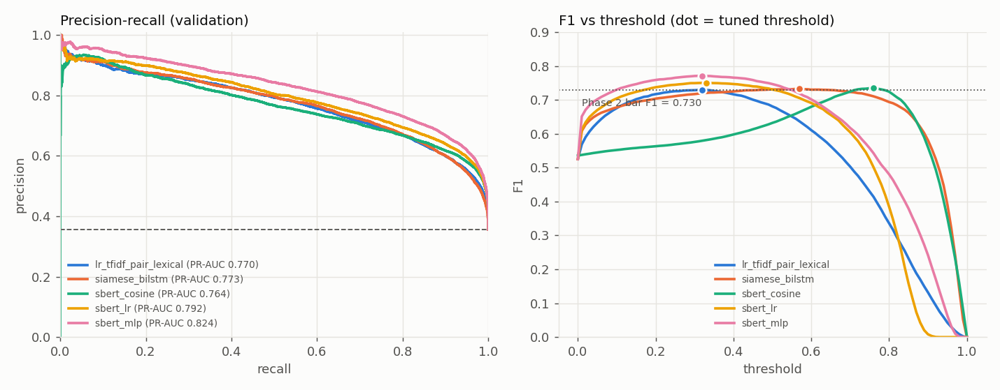
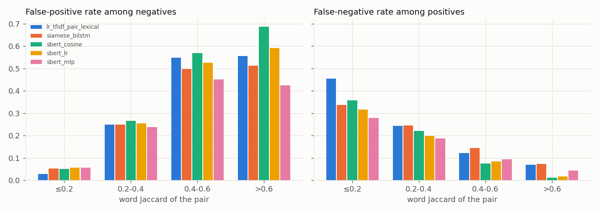

# Phase 3: Deep Semantic Matching

All numbers are on the frozen **validation** split (38,138 pairs, 35.6% positive), the same split used in Phase 2.
The test split was never read: every Phase 3 loader refuses it, a test enforces that, and the test-file hash still
matches `split_metadata.json`.

**Bar to beat (Phase 2, `lr_tfidf_pair_lexical`): F1 0.730, PR-AUC 0.771.**

## Results at a glance

| Model | Threshold τ* | **F1** | Precision | Recall | ROC-AUC | **PR-AUC** | Beats 0.730 F1? | ΔF1 vs Phase 2 (95% CI) |
|---|---|---|---|---|---|---|---|---|
| Phase 2: TF-IDF pair + lexical LR | 0.32 | 0.730 | 0.659 | 0.818 | 0.874 | 0.771 | (the bar) | – |
| **A. Siamese BiLSTM** | 0.57 | 0.732 | 0.662 | 0.820 | 0.874 | 0.773 | nominally, **not significantly** | +0.002 [−0.002, +0.007] |
| B1. MiniLM cosine only | 0.76 | 0.735 | 0.640 | 0.863 | 0.876 | 0.765 | nominally, **not significantly** | +0.005 [−0.001, +0.010] |
| B2. MiniLM + LR head | 0.33 | 0.750 | 0.659 | 0.871 | 0.891 | 0.792 | **yes** | +0.020 [+0.015, +0.025] |
| **B3. MiniLM + MLP head** | 0.32 | **0.771** | **0.694** | 0.868 | **0.907** | **0.824** | **yes** | **+0.041 [+0.036, +0.047]** |

- **τ\*:** the validation-F1-optimal threshold. The 95% CI comes from a paired bootstrap: 1,000 resamples of the validation pairs, each model kept at its own frozen τ\*.


- **Primary semantic model for later phases: B3, frozen `all-MiniLM-L6-v2` + MLP head.** It also beats the Phase 2 bar on PR-AUC, by +0.053 (95% CI [+0.046, +0.060]).
- **Read with the contamination caveat in §5.** MiniLM's pretraining data includes Quora duplicate triplets.

Reproduce:
```bash
python scripts/encode_questions.py --model sentence-transformers/all-MiniLM-L6-v2      # ~30 min CPU, cached
python scripts/run_sbert.py                                                            # ~3 min
python scripts/train_bilstm.py                                                         # ~1-2 h CPU, checkpointed
python scripts/encode_questions.py --model sentence-transformers/nli-distilroberta-base-v2 --control-subset
python scripts/run_encoder_control.py
python scripts/compare_phase3.py                                                       # analysis, latency, probes
```
Artifacts: `artifacts/phase3/` (`bilstm/`, `sbert_all-MiniLM-L6-v2/`, `encoder_control.json`, `comparison.json`), logs in
`artifacts/logs/phase3_*.log`, cached embeddings in `data/processed/embeddings/`. Phase 2 artifacts are untouched.

## 1. Setup and data discipline

- **Hardware:** Intel i5-1335U laptop CPU (10 cores), 16 GB RAM, **no CUDA GPU** (Intel Iris Xe only).
  The code calls `get_device()`, which uses CUDA when available and otherwise the CPU. Everything here ran on CPU.
- **Framework:** PyTorch 2.14 (CPU build) and sentence-transformers 6.1. No TensorFlow.
- **Data roles:**

  | Data | Used for |
  |---|---|
  | train, minus a 5% **question-disjoint dev slice** (289,164 pairs) | fitting |
  | dev slice (15,220 pairs, whole question-graph components, 0 shared questions) | BiLSTM early stopping, choice of C for the LR head, MLP early stopping |
  | validation | only the decision threshold τ\* and the final comparison |

  Phase 2 chose C on validation. Phase 3 is stricter, because validation is reserved for threshold tuning and model comparison.
- **Threshold optimism check:** τ is tuned on one half of validation and F1 measured on the other. For every model this matches
  the in-sample tuned F1 within 0.002 (e.g. MLP 0.7707 vs 0.7711).

## 2. Model A: Siamese BiLSTM ([src/models/siamese_bilstm.py](../src/models/siamese_bilstm.py))

```
question ─► Phase 2 tokens ─► Embedding(43,109 × 200) ─► BiLSTM(128 per direction) ─► masked max-pool ─► u ∈ R^256
                                    (the SAME encoder, with shared weights, for both questions)
[|u − v|, u ⊙ v, cos(u, v)] ─► Linear(513→256) ─► ReLU ─► Dropout(0.2) ─► Linear(256→1) ─► sigmoid
```

- **Why a Siamese architecture:** the task compares two texts of the same kind. Encoding each question separately into a vector
  and then comparing the vectors means any question can be encoded once and compared against many others (retrieval-friendly).
  It also forces the model to learn a *representation* of the question rather than cross-attention shortcuts.
- **Why shared weights:** both inputs are questions from the same distribution, so one encoder suffices and halves the parameters.
  It also guarantees that identical questions get identical vectors, and that swapping A and B cannot change the score
  (unit-tested to 1e-6).
- **Why a BiLSTM:** it reads the sequence in both directions, so each position's state sees left *and* right context.
  Word order matters for questions ("India→Pakistan" vs "Pakistan→India" in Phase 2's role-reversal examples), and bag-of-words
  models cannot see it. **Max-pooling** keeps the strongest feature from any position, which works well for spotting a decisive word.
- **How the vectors are compared:** `|u−v|` records *where* the two questions differ, `u⊙v` records *what they share*, and cosine
  gives a single overall-alignment score. All three are symmetric in (A, B).
- **Training:**
  - Tokens: the Phase 2 tokens (negation and numbers preserved). The vocabulary comes from the fit questions only (min_freq 2), so 1.1% of validation tokens are unknown.
  - Optimisation: Adam (lr 1e-3), batch 256, length-bucketed batches with `pack_padded_sequence` (no compute wasted on padding), gradient clipping at 1.0.
  - Early stopping on dev PR-AUC with patience 1. The run stopped after epoch 7; **the best epoch was 5** (dev PR-AUC 0.747).
  - Checkpointed every epoch with exact resume. An interrupted run's epoch 1 was reproduced bit-for-bit after restart.
- **Embeddings are randomly initialised** (no GloVe). That keeps the model self-contained and free of external pretraining,
  but it is the main reason it cannot learn rare synonyms. See the limitations.
- **Size:** 9.09M parameters, 8.6M of them in the embedding table.

**Outcome:** F1 0.732 and PR-AUC 0.773, statistically indistinguishable from the Phase 2 baseline. Its error profile is different, though (§6):
it cuts low-overlap false negatives, but it is **poorly calibrated** (ECE 0.106, versus 0.033 for the baseline), which is why τ\* = 0.57.

## 3. Model B: frozen sentence transformer + light heads

- **Encoder:** `sentence-transformers/all-MiniLM-L6-v2`, with 22.7M parameters, 384-dimensional output, 6 layers and mean pooling, used **frozen**.
  It was chosen as the smallest mainstream SBERT-style encoder. Raw question text is encoded (the transformer has its own tokeniser),
  inputs are truncated at 128 word-pieces (p99 question length is 31 words), and embeddings are L2-normalised.
- **Encoding:** each unique question is encoded once. That is 424,012 train and 53,610 validation questions at ~295 questions/s on CPU
  (about 27 minutes in total), cached as float16 in `data/processed/embeddings/`. The same cache feeds Phase 4 clustering.
- **Heads**, all on the order-invariant vector `[|u−v|, u⊙v, cos]` (769 dimensions):

| Head | Training | Rationale |
|---|---|---|
| B1 cosine | none; τ tuned on val | the "single embedding-similarity threshold" the research question challenges |
| B2 logistic regression | C ∈ {0.1, 1, 10} on dev → C = 1 | simplest learned head |
| B3 MLP (769→256→1, dropout 0.2) | Adam, early stopping on dev (patience 3), best dev PR-AUC 0.811 at epoch 25 | **justified by measurement:** over B2, ΔF1 +0.021 (95% CI [+0.018, +0.024]) and ΔPR-AUC +0.031 ([+0.028, +0.035]), from a paired bootstrap. A linear head cannot model interactions between dimensions such as "these differ *and* those agree". |

**No transformer fine-tuning was done.** The specification allows it only if the simpler sentence-transformer approach
clearly underperforms, and it did the opposite: the frozen encoder with a 197k-parameter MLP beats the bar by +0.041 F1.
Fine-tuning would also add hours of CPU training and worsen the contamination question below.

## 4. Engineering issues found and fixed

| Issue | Evidence | Fix |
|---|---|---|
| **Subnormal floats** made the MLP 35× slower | epochs went 4 s → 100–140 s from epoch 3 on, same data and model | `torch.set_flush_denormal(True)` in `configure_threads()`; every epoch then took ~3.7 s. Results moved by ≤0.003 F1. The first run is kept as `metrics_run1_denormal.json`. |
| A session ended mid-training and killed both jobs | the first BiLSTM run was lost after epoch 1 | per-epoch checkpoint with exact resume (model, optimiser, numpy and torch RNG, early-stopping state) |
| Laptop on battery | CPU pinned at 1.3 GHz; control encoder at 24 sentences/s versus 101 benchmarked | none needed; timing columns below come from mains power |
| The Phase 3 install upgraded numpy 1.26 → 2.5 | could change RNG streams | re-verified: the frozen split regenerates identically and all tests pass |
| Model-size bug in the first comparison run | MiniLM reported as 281 MB (the HF repo ships ONNX/OpenVINO copies) | size measured from the fp32 weights actually loaded (86.6 MB) |

## 5. Pretraining contamination check

The `all-MiniLM-L6-v2` model card lists **103,663 "Quora Question Triplets"** among its training data, from the same Quora release
as this dataset. Some validation duplicates may therefore have been seen as positive pairs during pretraining. They can't be
identified, so I ran a control: the same head, trained on the same fixed 60,000-pair train subset, compared on validation for two encoders
(`scripts/run_encoder_control.py`):

| Encoder | Pretraining | Parameters | Cosine F1 / PR-AUC | LR (60k) F1 / PR-AUC |
|---|---|---|---|---|
| all-MiniLM-L6-v2 | 1B+ pairs **incl. Quora triplets** | 22.7M | 0.735 / 0.765 | 0.743 / 0.784 |
| nli-distilroberta-base-v2 | NLI (its card lists no Quora data) | 82.1M | 0.690 / 0.699 | 0.713 / 0.750 |

MiniLM leads by **3.0–4.5 F1 points** despite being 3.6× smaller. This gap is an **upper bound on the contamination effect, not a
measurement of it**: MiniLM was also trained on far more, and more varied, paraphrase data. What can be said:

- part of MiniLM's absolute advantage over the BiLSTM and TF-IDF may come from having seen Quora duplicates;
- **an encoder with no listed Quora exposure, plus a linear head, does not beat the Phase 2 bar** (0.713 < 0.730);
- the project's research question concerns *relative* effects (clusters, constraints, thresholds) on top of a fixed encoder,
  so contamination affects every Phase 4–7 variant equally. Absolute scores should still not be quoted as "unseen-data" performance.

## 6. Error analysis

The heuristic tags (`entity_diff`, `number_diff`, `negation_diff`) are the same as in Phase 2. Rates are compared within word-Jaccard bands,
because raw tag rates are confounded by overlap. Source: `artifacts/phase3/comparison.json`.

### 6.1 Low-overlap false negatives and high-overlap false positives



| Model | FNR, Jaccard ≤0.2 | FNR 0.2–0.4 | FPR 0.4–0.6 | **FPR >0.6** | Overall FPR | Overall FNR |
|---|---|---|---|---|---|---|
| Phase 2 TF-IDF + lexical | 0.455 | 0.244 | 0.547 | 0.555 | 0.234 | 0.182 |
| Siamese BiLSTM | 0.337 | 0.245 | 0.498 | 0.513 | 0.232 | 0.180 |
| MiniLM cosine | 0.358 | 0.221 | 0.568 | **0.686** | 0.269 | 0.137 |
| MiniLM + LR | 0.316 | 0.198 | 0.526 | 0.590 | 0.250 | 0.129 |
| **MiniLM + MLP** | **0.279** | **0.188** | **0.451** | **0.425** | **0.212** | 0.132 |

- **Low-overlap false negatives** (synonyms, aliases) are where every deep model gains most. The MLP misses 28% of
  low-overlap duplicates, versus 46% for TF-IDF. Examples it fixes: "famous flute songs" / "famous flute music" (0.30 → 0.93);
  "What is so bad about genetically modified crops?" / "…concerns with GMOs?" (0.30 → 0.52).
- **High-overlap false positives** get **worse** with raw embedding cosine: it accepts 69% of high-overlap negatives,
  versus 56% for TF-IDF. A single embedding-similarity threshold is the worst option on exactly the pairs this project targets.
  Learned heads recover: the LR head gets to 59%, and the MLP to 43%, the best of all models.

### 6.2 Entity, number and negation mismatches (FPR among negatives with the tag)

| Model | entity, J > 0.6 | number, J > 0.6 | negation, J > 0.6 | entity, 0.4–0.6 | number, 0.4–0.6 | negation, 0.4–0.6 |
|---|---|---|---|---|---|---|
| Phase 2 TF-IDF + lexical | 0.439 | 0.513 | 0.639 | 0.336 | 0.345 | 0.464 |
| Siamese BiLSTM | 0.360 | **0.397** | **0.525** | 0.322 | **0.268** | **0.417** |
| MiniLM cosine | 0.596 | **0.813** | **0.836** | 0.386 | 0.542 | 0.597 |
| MiniLM + LR | 0.431 | 0.747 | 0.820 | 0.301 | 0.491 | 0.550 |
| MiniLM + MLP | **0.216** | 0.470 | 0.721 | **0.242** | 0.375 | 0.441 |

Sample sizes for the J > 0.6 band: 1,425 entity, 300 number and 61 negation negatives (the negation estimates are noisy).

- **Sentence embeddings are nearly blind to numbers and negation.** Raw cosine accepts 81% of high-overlap number mismatches and
  84% of negation mismatches. The LR head barely helps (75%, 82%).
- **The MLP fixes most entity mismatches** (0.44 → 0.22) but **number and negation stay weak** (0.47, 0.72).
- **The BiLSTM is best on numbers and negation**, because it reads the Phase 2 tokens, where `not` and `20` are explicit
  tokens. Despite its weaker overall score, this is evidence that **explicit token-level constraint signals carry information
  the sentence embedding drops**, which is the premise of Phase 6.

### 6.3 Sanity probes (hand-written, not from any split; ✓ = predicted duplicate at the model's τ\*)

| Type | Pair | TF-IDF+lex | BiLSTM | cosine | LR | MLP |
|---|---|---|---|---|---|---|
| identical | "What is formwork?" ×2 | 0.00 ✗ | 0.10 ✗ | 1.00 ✓ | 0.85 ✓ | 0.96 ✓ |
| identical | "Who founded Microsoft?" ×2 | 0.72 ✓ | 0.94 ✓ | 1.00 ✓ | 0.82 ✓ | 0.93 ✓ |
| paraphrase | lose weight quickly / fastest way to lose weight | 0.82 ✓ | 0.95 ✓ | 0.87 ✓ | 0.79 ✓ | 0.82 ✓ |
| entity | founded Microsoft / founded Apple | 0.16 ✗ | **0.59 ✓** | 0.61 ✗ | 0.03 ✗ | 0.03 ✗ |
| number | lose **5** kg / lose **20** kg in a month | 0.50 ✓ | 0.72 ✓ | 0.88 ✓ | 0.56 ✓ | **0.34 ✓** |
| negation | believe / **not** believe in God | 0.36 ✓ | 0.78 ✓ | 0.90 ✓ | 0.72 ✓ | **0.32 ✓** |
| broader/narrower | learn programming / learn Python for data science | 0.61 ✓ | 0.06 ✗ | 0.66 ✗ | 0.22 ✗ | 0.27 ✗ |

- **Every model accepts the number and negation mismatches.** The MLP does so by the narrowest margin (0.336 and 0.320 against τ\* = 0.32).
- The pretrained encoder fixes the Phase 2 "exact duplicate → 0" failure. The BiLSTM repeats it, because "formwork" is out of
  vocabulary, so the pair reads as `what is <unk>`.

### 6.4 What the best model gets wrong now (manual inspection, MLP)

- **The most confident false positives are mostly label noise:** pairs identical up to punctuation or case, labelled 0
  ("How did non-Americans react upon hearing about **the** 9/11?" / "…about 9/11?" at 0.98; "How can I stop using whatsapp?" /
  "How do I stop using WhatsApp?"; "What parts should I upgrade on my PC?" / "What part…"). The model has reached the dataset's noise floor here.
- **The most confident false negatives are mostly broad or debatable Quora merges:** "drop a year after engineering for GATE"
  / "drop one year after BCA for MBA" (labelled 1); "What does ultra super critical technology mean?" / "What is super critical boiler?".
- **New false positives relative to Phase 2:** 2,066 negatives that TF-IDF got right and the MLP gets wrong (against 2,597 it fixes).
  They include number swaps ("i5-**7th** gen vs i7-**6th** gen"), scope changes ("best IT company" / "…best **for a fresher**"),
  and context-dependent questions ("How can I solve **this** maths problem?" ×2 phrasings).
- **Net effect versus Phase 2:** 4,255 pairs fixed and 3,037 broken. The fixes are mostly false negatives with low overlap (median Jaccard 0.40).

## 7. Latency and size (CPU, 10 threads, mains power)

| Model | Single pair (median) | Batch of 2,000 (per pair) | Parameters | Size on disk / in memory |
|---|---|---|---|---|
| Phase 2 TF-IDF + lexical LR | 2.7 ms | 0.14 ms | 0.71M | 7.7 MB (joblib) |
| Siamese BiLSTM | 3.8 ms | 0.33 ms | 9.09M | 35.8 MB |
| MiniLM cosine | 24.9 ms | 6.2 ms | 22.7M | 86.6 MB |
| MiniLM + LR | 26.1 ms | 6.1 ms | 22.7M | 86.6 MB |
| MiniLM + MLP | 27.9 ms | 6.8 ms | 22.9M | 87.4 MB |

Latency is end to end from raw text, including tokenisation and encoding both questions. The transformer is ~7× slower than the
BiLSTM for a single pair (~21× in batch) and ~49× slower than TF-IDF in batch, but under 30 ms for a single interactive pair on a laptop CPU, which is fine for the
Phase 9 demo. In a retrieval setting, question embeddings would be pre-computed, leaving only the 0.2M-parameter head per pair.

## 8. Choice of primary semantic model

**Frozen `all-MiniLM-L6-v2` + MLP head**, because:
- it has the best F1 (0.771) and PR-AUC (0.824), and the gains over Phase 2 are significant;
- it is well calibrated (Brier 0.120, ECE 0.024), which matters when thresholds are compared across clusters in Phase 7;
- its question embeddings are already cached for train and val, and they are exactly what Phase 4 clusters;
- its remaining weakness (numbers and negation) is measurable and is the target of Phase 6.

Its frozen τ\* = 0.32 is the **global threshold** that Phase 7 will compare against cluster-specific thresholds.

## 9. Limitations

1. **Contamination:** MiniLM saw Quora duplicate triplets in pretraining (§5). Absolute scores are optimistic; relative comparisons in later phases are less affected.
2. **The BiLSTM is under-resourced:** randomly initialised embeddings, one run, one seed, little tuning, and dev PR-AUC was noisy across epochs (0.737–0.747).
   Its 0.732 is a fair "small Siamese network from scratch" result, not an upper bound for recurrent models.
3. **Single seed for every neural model.** The bootstrap CIs capture sampling variation in validation, not training variance.
4. **The error tags are heuristics** (capitalisation as an entity proxy). They describe trends; they are not a ground-truth taxonomy.
5. Validation is used for τ\* and for reporting. The cross-half check shows the optimism is ≤0.002 F1; the test set will confirm in Phase 8.
6. Timing numbers come from one laptop CPU and will differ elsewhere.

## 10. Hand-off to Phase 4

- Cluster the cached **train** question embeddings (`data/processed/embeddings/all-MiniLM-L6-v2/train.npy`, 424,012 × 384).
- Primary scorer for the cluster analysis: `sbert_mlp` validation scores, saved in `artifacts/phase3/sbert_all-MiniLM-L6-v2/val_scores.csv`,
  with global τ\* = 0.32.
- Keep in mind for Phase 6: the MLP fails on number and negation mismatches, which the BiLSTM's explicit tokens partially capture.
