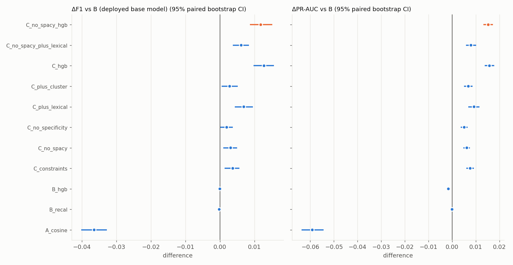
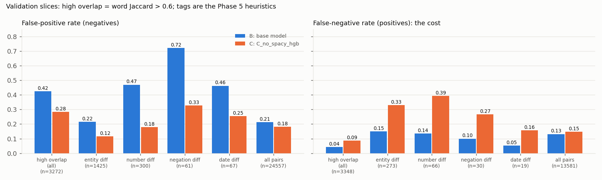

# Phase 6: Entity and Constraint Consistency Features

**Question:** do explicit, deterministic entity/number/date/negation/specificity signals improve duplicate detection beyond the Phase 3
semantic model? In particular, do they reduce the entity-sensitive false positives found in Phases 3 and 5?

**Answer (validation): yes, modestly and significantly, with a measurable cost.**
- The chosen spaCy-free model raises F1 from **0.771 to 0.783** (+0.012, 95% CI [+0.009, +0.015]) and PR-AUC from **0.824 to 0.839**.
- The worst-cluster F1 rises from 0.708 to 0.719.
- On high-overlap negatives it roughly **halves** false positives with an entity, number or negation difference.
- The price is more false negatives on true duplicates that contain a superficial constraint difference.
- **The largest single contributor is the specificity/length signal, not the explicit constraints.**

All numbers are on the frozen **validation** split. The test split was never read (enforced by tests). No LLM is used anywhere.

Reproduce:
```bash
python scripts/build_constraint_features.py   # annotate unique train/val questions once; pair features (~12 min CPU)
python scripts/crossfit_base.py               # 5-fold question-disjoint out-of-fold base scores for train (~9 min)
python scripts/train_meta.py                  # pre-specified variants, ablations, bootstrap, slices, probes (~15 min)
```
Artifacts: `artifacts/phase6/`. These are `variant_results.json` (every variant, every bootstrap), `chosen.json`, `meta_model.joblib`
(the frozen model, 373 KB), `val_scores.csv`, `slice_rates.json`, `manual_sample_flips.json`, `probes.json`, `crossfit_report.json` and `latency.json`.

## 1. Features ([src/features/constraints.py](../src/features/constraints.py))

Each unique question is annotated once; pair features are then computed from two annotations. **Every pair feature is exactly symmetric** in (A, B)
(unit-tested). An item of question A counts as *matched* if it appears in B's annotation **or as whole words in B's normalised text**. That makes
"india" vs "India" and "U.S." vs "US" consistent despite Quora's casing, which defeats both NER and capitalisation heuristics on one side.

| Group | What is extracted | Pair features (6 per extracted-item group) |
|---|---|---|
| **number** | digits incl. "1,000", "2.5k", "5kg"; number words *two…billion* ("one" omitted: "how does one…") | `any`, `both`, `unmatched_total`, `unmatched_max_side`, `mismatch` (both have numbers that disagree), `one_sided` |
| **date** (regex) | years 1800–2099 incl. "1990s", months, weekdays, today/tomorrow/yesterday | same six |
| **entity (heuristic)** | mid-sentence capitalised tokens and acronyms ("IT", "US", "i5"), dotted acronyms collapsed; skipped for ALL-CAPS questions | same six |
| entity / location / date (spaCy) | `en_core_web_sm` NER: ORG, PERSON, PRODUCT, … / GPE, LOC, FAC / DATE, TIME | same six (ablated, see §4) |
| **negation** | not, no, never, without, nor, none, nobody, nothing, neither, cannot, "n't" (via Phase 2 preprocessing), "non-" | `neg_xor` (polarity disagrees), `neg_count_diff` |
| **intent word** | first token if it is a wh-/auxiliary word | `wh_mismatch` |
| **specificity** | content words (stop words and negations removed), word counts | `extra_content_max/min` (content words only one side has), `content_subset` (one question's content is contained in the other's), `log_len_ratio`, `word_count_absdiff` |

**Bugs caught by the unit tests before any model was trained:**
- **"2.5k" parsed as {2, 5}:** regex backtracking; fixed with a single-alternative pattern.
- **"india" vs "India" flagged as a mismatch:** the whole-word check ran against text with punctuation attached.
- **"U.S." vs "US" mismatch, and "US"/"IT" dropped as stop words:** fixed by acronym collapsing and keeping all-caps acronyms.

The features had to be rebuilt after the regex fix. The stale build is preserved in `artifacts/logs/phase6_build_features_stale_regex.log`.

**How often signals fire (validation, negatives vs duplicates):** number mismatch 5.0% vs 1.4%; heuristic entity mismatch 26.9% vs 10.6%;
negation disagreement 11.5% vs 4.1%. Mismatches are 2.5–3.8× more frequent among non-duplicates. The exception is `content_subset`, which is
**twice as common among duplicates** (13.6% vs 6.0%): when one question's content words are contained in the other's, the pair is more often a
duplicate than not. That echoes Phase 5's finding that scope differences cut both ways.

## 2. Meta-classifier design

**Stacking without leakage (cross-fitting).** The meta-classifier learns how far to trust the base model's probability. The base model's
probabilities on its *own* training pairs are over-confident, so a meta-model trained on them would over-trust it. Every train pair is therefore scored
by a copy of the Phase 3 MLP head trained on the **other 4 of 5 question-disjoint folds** (`crossfit_base.py`). Each copy uses the same recipe,
a fixed 25 epochs (the Phase 3 best epoch), and needs no early-stopping data.

| Check | Value |
|---|---|
| Out-of-fold base PR-AUC on train (per fold) | 0.801 – 0.808 |
| Fold models scoring validation, PR-AUC (per fold) | 0.818 – 0.822 (deployed model: 0.824) |
| Deployed vs mean fold model on validation | Pearson 0.994, mean absolute difference 0.023 |

The deployed Phase 3 model is **unchanged** and supplies the validation (later, test) base probabilities. The meta-model therefore sees essentially the same score
distribution at training and at evaluation time.

**Pre-specified variants** ([src/models/meta.py](../src/models/meta.py)) were fixed before any validation result was seen:
- **Hyperparameters are fixed:** LogisticRegression with C = 1 on standardised features, and HistGradientBoosting with defaults and internal early stopping.
- **Validation was used only** for each variant's decision threshold and for comparing the fixed variants.
- **Base input:** the logit of the base probability.
- **Training data:** all 304,384 train pairs.

| Variant | Inputs | Role |
|---|---|---|
| **A** `A_cosine` | MiniLM cosine only | specification baseline A: semantic similarity |
| **B** `B_base` | deployed Phase 3 probability | specification baseline B, **the bar: F1 0.771** |
| `B_recal` | LR on the base logit only | control: does re-fitting a meta-model alone change anything? |
| `B_hgb` | boosted trees on the base logit only | control: is any boosting gain just non-linear recalibration? |
| **C** `C_constraints` | base + all constraint groups incl. spaCy (LR) | specification variant C |
| `C_no_spacy` | base + spaCy-free groups (LR) | spaCy ablation |
| `C_plus_lexical`, `C_no_spacy_plus_lexical` | + Phase 2 word/char overlap | more features |
| `C_hgb`, `C_no_spacy_hgb` | same features, gradient-boosted trees | non-linear model |
| `C_plus_cluster` | + frozen-cluster one-hot | ablation only; per-cluster offsets are Phase 7's question |
| `C_minus_*`, `HGB_minus_*` | leave one feature group out | attribution |

**Selection rule** (`choose_variant`, written before the run):
1. Start from `C_constraints`.
2. Drop spaCy unless it improves PR-AUC by ≥ 0.005 with a CI excluding 0. The spec says to use spaCy "only if genuinely helpful".
3. Switch to a more complex variant (+lexical, then boosted trees) built on the step-2 feature set, only if it beats the current choice by ≥ 0.005 PR-AUC
   with a CI excluding 0. `C_plus_cluster` is never selected here.

**Corrections made during the phase (both reported, neither changes the conclusion):**
- *Run 1:* step 3 compared `C_hgb`, which is built **with** spaCy features, against `C_no_spacy`, even though step 2 had just dropped spaCy. The rule now
  builds complex variants on the step-2 feature set (`artifacts/logs/phase6_train_meta_run1_inconsistent_rule.log`).
- *Run 2:* the "spaCy-free" variants still used a date group that included spaCy DATE spans, so a deployed spaCy-free model would have seen different
  features than in training. A regex-only `date_heuristic` group was added, and a **train/serve parity test** now checks that features recomputed
  through the inference path equal the stored training features (`artifacts/logs/phase6_train_meta_run2_spacy_dates.log`).
- The final run (run 3) re-runs **bit-identically**.

## 3. Results (validation)



| Model | τ\* | **F1** | Precision | Recall | ROC-AUC | **PR-AUC** | Macro-cluster F1 | **Worst-cluster F1** | ΔF1 vs B [95% CI] | ΔPR-AUC vs B [95% CI] |
|---|---|---|---|---|---|---|---|---|---|---|
| A: cosine similarity only | 0.76 | 0.735 | 0.640 | 0.863 | 0.876 | 0.765 | 0.733 | 0.651 (C6) | −0.036 [−0.040, −0.033] | −0.059 [−0.064, −0.054] |
| **B: semantic model probability** | 0.32 | **0.771** | 0.694 | 0.868 | 0.907 | **0.824** | 0.770 | **0.708** (C6) | – | – |
| B_recal (control) | 0.36 | 0.771 | 0.695 | 0.866 | 0.907 | 0.824 | 0.770 | 0.709 | −0.000 [−0.001, +0.000] | 0.000 |
| B_hgb (control) | 0.34 | 0.771 | 0.692 | 0.871 | 0.907 | 0.822 | 0.770 | 0.707 | −0.000 [−0.001, +0.001] | −0.002 [−0.002, −0.001] |
| C: constraints incl. spaCy (LR) | 0.38 | 0.775 | 0.710 | 0.854 | 0.910 | 0.831 | 0.773 | 0.704 | +0.004 [+0.001, +0.006] | +0.008 [+0.006, +0.009] |
| C_no_spacy (LR) | 0.38 | 0.774 | 0.709 | 0.853 | 0.910 | 0.830 | 0.773 | 0.706 | +0.003 [+0.001, +0.005] | +0.006 [+0.005, +0.008] |
| C_no_spacy_plus_lexical (LR) | 0.37 | 0.777 | 0.705 | 0.866 | 0.912 | 0.832 | 0.776 | 0.711 | +0.006 [+0.004, +0.008] | +0.008 [+0.006, +0.010] |
| C_hgb (incl. spaCy) | 0.34 | 0.784 | 0.706 | 0.881 | 0.916 | 0.840 | 0.782 | 0.722 (C2) | +0.013 [+0.010, +0.016] | +0.016 [+0.014, +0.018] |
| **C_no_spacy_hgb (chosen)** | **0.38** | **0.783** | **0.723** | 0.853 | **0.916** | **0.839** | **0.781** | **0.719** (C6) | **+0.012 [+0.009, +0.015]** | **+0.015 [+0.013, +0.017]** |
| C_plus_cluster (ablation) | 0.36 | 0.774 | 0.701 | 0.864 | 0.910 | 0.831 | 0.772 | 0.698 | +0.003 [+0.001, +0.005] | +0.007 [+0.005, +0.009] |

(The CIs come from paired bootstraps over 1,000 resamples of validation pairs, with each model at its own frozen τ\*. Cluster metrics use the frozen Phase 4 clusters
with the Phase 5 pair-average rule.)

**Selection log:**
1. *spaCy:* `C_constraints` beats `C_no_spacy` by only +0.0014 PR-AUC (CI [+0.0006, +0.0023]), below the 0.005 bar, so **spaCy is dropped**.
   With boosted trees, spaCy adds +0.0005 [−0.0003, +0.0013].
2. *Lexical overlap:* +0.0018 [−0.0001, +0.0036], so it is not adopted.
3. *Boosted trees:* `C_no_spacy_hgb` beats `C_no_spacy` by +0.0091 [+0.0075, +0.0107], so it **switches**. The model is sklearn's
   HistGradientBoosting, so no new dependency is added.

**Controls:** re-fitting a logistic model on the base score changes nothing (`B_recal`), and boosting the base score alone changes nothing (`B_hgb`).
**The gains come from the added features, not from re-fitting or non-linearity.**

**Calibration** also improves: ECE 0.024 → 0.015 and Brier 0.120 → 0.113. The cross-half threshold check gives F1 0.781, against 0.783 in-sample.

### Which features matter (leave-one-group-out from the chosen model)

| Removed group | ΔF1 [95% CI] | ΔPR-AUC [95% CI] | Verdict |
|---|---|---|---|
| specificity | **−0.010 [−0.013, −0.007]** | **−0.009 [−0.011, −0.008]** | largest contributor |
| number | −0.003 [−0.005, −0.001] | −0.006 [−0.007, −0.004] | significant |
| negation | −0.000 [−0.002, +0.002] | −0.003 [−0.005, −0.001] | significant on ranking |
| entity (heuristic) | −0.000 [−0.002, +0.002] | −0.001 [−0.002, −0.001] | small but significant on ranking |
| intent word | −0.000 [−0.002, +0.001] | −0.001 [−0.002, −0.000] | small |
| date (regex) | +0.000 [−0.001, +0.002] | −0.001 [−0.003, +0.000] | not significant (regex date mismatch in 0.3% of pairs, one-sided in 2.2%) |

Specificity only pays off **non-linearly**. Removing it costs −0.002 F1 in the logistic model (`C_minus_specificity` vs `C_constraints`) but −0.010 in the boosted model.
Its effect depends on the base score: extra content words matter differently for a pair the encoder already rates 0.9 than for one it rates 0.4.
In the logistic model the largest constraint coefficients (standardised, log-odds) are: number unmatched −0.42, entity unmatched −0.17,
negation disagreement −0.10. The base logit's coefficient is 3.81.

## 4. Did entity-sensitive false positives decrease?



| Validation slice (Phase 5 heuristic tags; high overlap = word Jaccard > 0.6) | Negatives | FPR B → C | Positives | FNR B → C |
|---|---|---|---|---|
| All pairs | 24,557 | 0.212 → **0.181** | 13,581 | 0.132 → 0.147 |
| High overlap | 3,272 | 0.425 → **0.283** | 3,348 | 0.043 → 0.088 |
| Entity difference, high overlap | 1,425 | 0.216 → **0.115** (−47%) | 273 | 0.150 → 0.330 |
| Number difference, high overlap | 300 | 0.470 → **0.180** (−62%) | 66 | 0.136 → 0.394 |
| Negation difference, high overlap | 61 | 0.721 → **0.328** (−55%) | 30 | 0.100 → 0.267 |
| Date difference, high overlap | 67 | 0.463 → **0.254** | 19 | 0.053 → 0.158 |

**Yes. Entity, number and negation false positives at high overlap fall by roughly half.** The **cost** is real: positives that contain a superficial
constraint difference are now rejected 2–3× more often. Overall, on validation:
- 1,153 false positives fixed and 307 false negatives fixed;
- 509 new false negatives and 377 new false positives;
- **net 776 fewer false positives and 202 more false negatives.**

The new false negatives (sampled) are:
- mostly **borderline pairs nudged just under τ** (0.35 → 0.33);
- **number-format false alarms**: "Premier League **2016-2017**" vs "**2016-17**";
- **rhetorical negation**: "Is Yishan Wong going to…" vs "Why **isn't** Yishan Wong going to…", labelled duplicate;
- **scope on true duplicates**: "I am 25 and wish to start MMA…" vs "Am I too old to start learning martial arts?"

**The Phase 5 hand-labelled errors** (60 false positives and 60 false negatives of the base model, now scored by C at its own τ):

| Phase 5 FP category | Count | Fixed by C |
|---|---|---|
| Entity mismatch | 6 | **4** |
| Number mismatch | 2 | 1 |
| Negation mismatch | 2 | 1 |
| Broader / narrower | 15 | 3 |
| Different aspect, same topic | 9 | 3 |
| Attribute swap | 7 | 1 |
| Likely label noise | 16 | 1 |
| Date/time mismatch, context-dependent | 3 | 0 |
| **Total** | **60** | **14** |

C also fixes 11 of the 60 sampled false negatives (6 broader/narrower, 4 low-overlap paraphrases, 1 debatable merge). It barely touches the
likely-mislabelled false positives (1 of 16), as expected: those pairs really are near-identical.

### Sanity probes (hand-written; `probes.json`)

| Type | Pair | B prob → dup? | C prob → dup? |
|---|---|---|---|
| paraphrase | "How can I lose weight quickly?" / "What is the fastest way to lose weight?" | 0.82 ✓ | 0.80 ✓ |
| paraphrase | "Is it possible to hack fb?" / "How do we hack a Facebook account?" | 0.53 ✓ | 0.54 ✓ |
| entity | "temperament of a Doberman/Lab mix" / "…a Lab/Pitbull mix" | 0.40 **✓** | 0.20 ✗ |
| number | "lose **5** kg in a month" / "lose **20** kg in a month" | 0.34 **✓** | 0.12 ✗ |
| number | "best phone under **10000** rupees" / "…under **20000** rupees" | 0.62 **✓** | 0.32 ✗ |
| negation | "Why do people believe in God?" / "…**not** believe…" | 0.32 **✓** | 0.10 ✗ |
| negation | "examples of movable joints" / "…**non-**movable joints" | 0.31 ✗ | 0.14 ✗ |
| entity / date / location | Microsoft vs Apple; 2012 vs 2016 election; Delhi vs Mumbai hotels | ✗ | ✗ |
| broader / narrower | "learn programming" / "learn Python programming for data science" | 0.27 ✗ | 0.31 ✗ |
| case only | "…visit in india?" / "…visit in India?" | 0.98 ✓ | 0.95 ✓ |
| acronym | "…the U.S. army?" / "…the US Army?" | 0.88 ✓ | 0.87 ✓ |

**All four base-model false accepts are corrected** (entity, two numbers, negation), while paraphrases, a case-only difference and an acronym variant stay duplicates.

### Per cluster (frozen Phase 4 clusters)

| Cluster | F1 B → C | Precision B → C | FPR B → C |
|---|---|---|---|
| C0 Definitions & technical concepts | 0.711 → **0.735** | 0.600 → 0.655 | 0.217 → 0.165 |
| C7 Money & business | 0.775 → **0.797** | 0.734 → 0.774 | 0.182 → 0.147 |
| C3 Health, body & food | 0.772 → 0.788 | 0.690 → 0.722 | 0.258 → 0.218 |
| C10 Learning & exam preparation | 0.787 → 0.800 | 0.695 → 0.719 | 0.334 → 0.296 |
| C1, C11, C6, C5 | +0.010 to +0.013 | up | down |
| C8, C4, C9 | +0.004 to +0.008 | up | down |
| **C2 Accounts, apps & platforms** | 0.733 → **0.727** (−0.005) | 0.648 → 0.653 | 0.180 → 0.172 |

**11 of 12 clusters improve.** The worst cluster (C6, Education) rises from 0.708 to 0.719. The largest gains are in C0, the "definitions" cluster where
Phase 5 found entity and scope false positives. The one decline is C2, apps/accounts, whose false negatives are mostly paraphrases that constraint
features cannot help, and where tightening the threshold costs recall.

## 5. Cost

| | Base (Phase 3) | Meta (chosen) |
|---|---|---|
| Extra dependencies | – | none (spaCy dropped; sklearn trees) |
| Model artifact | 87 MB encoder + 0.8 MB head | + 373 KB `meta_model.joblib` |
| Latency, single pair (CPU, median) | 46 ms | 72 ms |
| Latency, batch of 2,000 (per pair) | 10.7 ms | 11.2 ms |

The CPU was slower in this session than in Phase 3, so the two models were timed **side by side** (`latency.json`). Encoding each question
twice inside the meta predictor was found and fixed (it had doubled latency).

## 6. Train/serve consistency

- **Feature parity:** spaCy-free features recomputed through the inference path equal the stored training features exactly (unit test on 300 validation pairs).
- **Embedding parity:** training and evaluation used embeddings cached as float16, so inference now rounds fresh embeddings through float16 as well.
- **Known residual:** boosted trees are step functions. A base score within about 1e-6 of a learned split point can land on either side depending on encoder
  numerics, so the full raw-text pipeline reproduces the stored validation scores with a mean difference of 0.0015, but **3 of 2,000 decisions (0.15%)
  flip**. A smoother logistic model would avoid this but loses 0.009 PR-AUC. Phase 8 must score the test set through one consistent path
  (cache, then features, then meta-model).

## 7. Limitations

1. **The gain is modest:** +0.012 F1, and the largest share comes from generic specificity/length signals rather than from entity/number/negation consistency itself.
2. **There is an FN trade-off:** constraint mismatches on true duplicates (format variants like "2016-17", rhetorical negation, scope) are now missed more often.
3. **The entity heuristic is crude:** capitalisation and acronyms on a corpus with unreliable casing. spaCy NER did not help enough to justify the
   dependency (+0.001 PR-AUC). Neither handles aliases ("fb" vs "Facebook") or synonymous locations ("Delhi" vs "Delhi NCR").
4. **Validation is used for the decision threshold and for picking among about 20 fixed variants.** The selection rule was pre-registered, but two fixes to
   that rule were made after seeing results (both reported, conclusion unchanged). Phase 8's frozen test evaluation is the real check.
5. **The slice tags are the Phase 5 heuristics,** which overlap with the features themselves. The manual-sample flips (§4) are the independent check, and they are small.
6. Around 27% of the base model's false positives look mislabelled (Phase 5), a ceiling no feature can lift.

## 8. Hand-off to Phase 7

- **Global system to compare against:** `C_no_spacy_hgb`, F1 0.783 at its own global τ = 0.38 (`meta_model.joblib`, `val_scores.csv`).
- **Interaction with cluster thresholds:** cluster one-hot features did **not** help inside the meta-model (`C_plus_cluster`: +0.003 F1 vs B, below
  plain `C_constraints`). That is weak evidence that per-cluster offsets add little once constraint features are present. Phase 7 tests this properly.
- Phase 7 should compare global vs per-cluster thresholds for **both** B (base) and C (meta). The worst-cluster gains above (C6 +0.011, C0 +0.024)
  came from features at a single global threshold.
