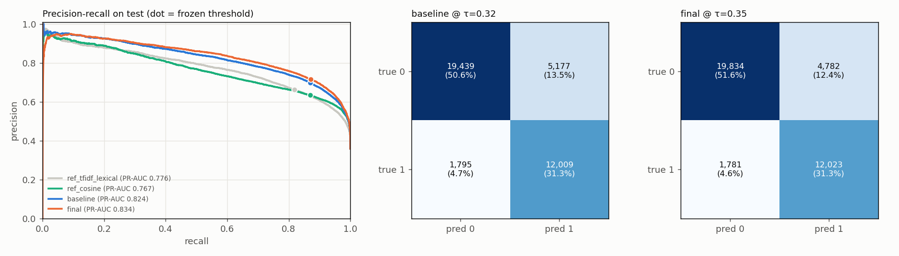
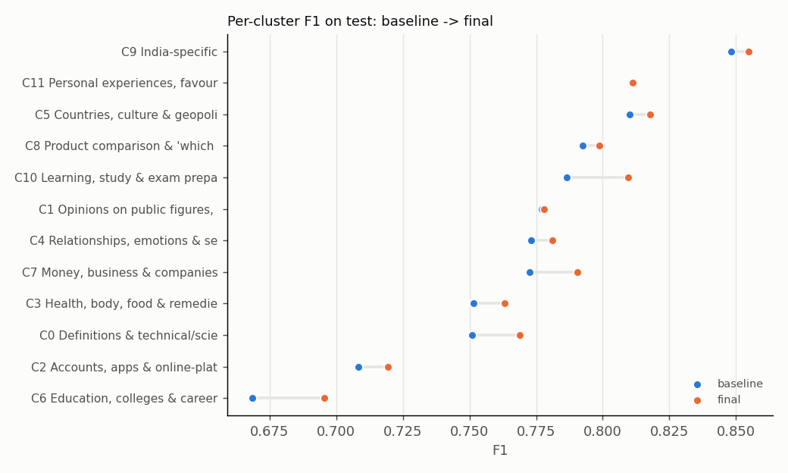

# Phase 8: Final Frozen Test Evaluation

**One evaluation on the held-out test split** (38,420 pairs, 35.9% duplicates; no question shared with train or validation),
with every model, feature, cluster model, threshold and piece of scoring code frozen and hash-verified beforehand.

**Result:** the final system (semantic model + entity/constraint features, one global threshold) beats the baseline (semantic model, one global
threshold) on every headline metric. The gains match validation:

- **F1** 0.775 → **0.786** (+0.011, 95% CI [+0.008, +0.014])
- **PR-AUC** 0.824 → **0.834** (+0.009 [+0.006, +0.012])
- **Macro-cluster F1** 0.771 → **0.782** (+0.012 [+0.009, +0.015])
- **Worst-cluster F1** 0.668 → **0.695** (+0.026 [+0.010, +0.042])

All 12 clusters improve or tie. Cluster-specific thresholds are **not** part of the final system: Phase 7 rejected them. These results describe
this dataset and split only.

## 1. Freezing protocol

| Step | Evidence |
|---|---|
| 1. **Freeze manifest:** SHA-256 of 25 files (encoder weights hashed separately): MLP head, frozen centroids, meta-model, both threshold policies, configs, and every module on the scoring path including `final_evaluation.py` itself. Text files are hashed with line endings normalised, so the hashes survive a git checkout | `artifacts/phase8/freeze_manifest.json` (records code commit `7e121b3`); committed, with the passing dry run, by `5b5e214` *before* the test run |
| 2. **Validation dry run** of the identical pipeline: must reproduce every system's recorded validation F1 **exactly**, with **zero decision flips** | `artifacts/phase8/dry_run_val/` (passed) |
| 3. **One test run:** verifies every hash, verifies `test.csv` is byte-identical to the Phase 1 frozen split, asserts zero question overlap with train and validation, writes a marker, and **refuses to run again** | `artifacts/phase8/TEST_EVALUATED.json`, `artifacts/logs/phase8_test_evaluation.log` |
| 4. Tests enforce it: nothing has changed since the freeze, the final policy is global τ = 0.35, and the evaluation happened after the freeze | `tests/test_final_evaluation.py` |

**What the dry run caught (before the test split was read).** The first dry run did **not** reproduce validation: 90 of 38,138 final-model
decisions flipped.
- **Cause:** the meta-model had been trained on features read back from CSV files, and freshly computed features differ by about one unit in the
  last place. HistGradientBoosting places some bin edges exactly on training values, so those tiny differences flipped decisions.
- **Fix:** inputs are rounded to 6 decimals inside the model, and base probabilities are cast to float32 before the logit.
- **Follow-up:** Phase 6 was retrained and Phase 7 re-run (conclusions unchanged; final τ 0.38 → 0.35). A strict all-pairs parity test was added and the freeze redone.
- **Two smaller fixes to the dry-run check itself:** a hard-coded expected F1 was replaced by values read from the phase result files, and the
  score tolerance was set to 6e-7 to account for float32 representation. Both were made before the test split was read, and all are in the git history.

## 2. Systems

| System | Model | Threshold (from validation) |
|---|---|---|
| **Baseline:** best non-adaptive semantic model, global threshold | Phase 3: frozen `all-MiniLM-L6-v2` + MLP head | global τ = 0.32 |
| **Final** | Phase 3 model → Phase 6 spaCy-free constraint features → HistGradientBoosting meta-model (`C_no_spacy_hgb`) | global τ = 0.35 (Phase 7 rejected cluster thresholds) |
| *References (context only)* | Phase 2 TF-IDF + lexical LR; Phase 3 Siamese BiLSTM; MiniLM cosine | their frozen validation thresholds |

## 3. Results on test

| System | τ | **F1** | Precision | Recall | **ROC-AUC** | **PR-AUC** | Accuracy | FPR | FNR | **Macro-cluster F1** | **Worst-cluster F1** |
|---|---|---|---|---|---|---|---|---|---|---|---|
| **Baseline** | 0.32 | 0.7750 | 0.6988 | 0.8700 | 0.9064 | 0.8243 | 0.8185 | 0.210 | 0.130 | 0.7709 | 0.6684 (C6) |
| **Final** | 0.35 | **0.7856** | **0.7154** | **0.8710** | **0.9144** | **0.8336** | **0.8292** | **0.194** | **0.129** | **0.7824** | **0.6954** (C6) |
| *TF-IDF + lexical LR (Phase 2)* | 0.32 | 0.7322 | 0.6623 | 0.8185 | 0.8759 | 0.7756 | – | – | – | 0.7241 | 0.5994 (C6) |
| *Siamese BiLSTM (Phase 3)* | 0.57 | 0.7362 | 0.6690 | 0.8185 | 0.8783 | 0.7810 | – | – | – | 0.7295 | 0.6011 (C6) |
| *MiniLM cosine only* | 0.76 | 0.7330 | 0.6338 | 0.8691 | 0.8735 | 0.7666 | – | – | – | 0.7298 | 0.6444 (C6) |

**Final − baseline** (paired bootstrap, 1,000 resamples of test pairs):

| Metric | Δ | 95% CI | Significant? |
|---|---|---|---|
| F1 | **+0.0106** | [+0.0076, +0.0136] | yes |
| Precision | +0.0167 | [+0.0132, +0.0200] | yes |
| Recall | +0.0010 | [−0.0032, +0.0050] | no (unchanged) |
| PR-AUC | **+0.0092** | [+0.0060, +0.0121] | yes |
| Macro-cluster F1 | **+0.0115** | [+0.0085, +0.0147] | yes |
| Worst-cluster F1 | **+0.0262** | [+0.0097, +0.0417] | yes |
| FPR | −0.0161 | [−0.0191, −0.0127] | yes |
| FNR | −0.0010 | [−0.0050, +0.0032] | no (unchanged) |

**Confusion matrices** (test, n = 38,420):

| | Baseline: pred 0 | Baseline: pred 1 | Final: pred 0 | Final: pred 1 |
|---|---|---|---|---|
| true 0 (24,616) | 19,439 | **5,177** | 19,834 | **4,782** |
| true 1 (13,804) | 1,795 | 12,009 | 1,781 | 12,023 |

That is 395 fewer false positives at the same recall. Decision changes: 1,000 false positives fixed and 416 false negatives fixed, against 605 new false positives and 402 new false negatives.

**Calibration:** ECE 0.027 → 0.019, Brier 0.120 → 0.114.

**Latency and size** (CPU, Intel i5-1335U, 10 threads, end to end from raw text; timed side by side, `artifacts/phase8/latency.json`):

| | Single pair (median / p95) | Batch of 2,000 (per pair) | Model artifacts |
|---|---|---|---|
| Baseline | 50.6 / 57.7 ms | 10.65 ms | encoder 86.6 MB + head 0.76 MB |
| Final | 69.2 / 77.6 ms | 11.05 ms (+4%) | + meta-model 0.35 MB (+ centroids 0.02 MB, used for reporting only) |

### Validation vs test

| System | F1 val → test | PR-AUC val → test | Worst-cluster F1 val → test |
|---|---|---|---|
| Baseline | 0.7711 → 0.7750 | 0.8237 → 0.8243 | 0.7076 → 0.6684 |
| Final | 0.7839 → 0.7856 | 0.8378 → 0.8336 | 0.7209 → 0.6954 |
| TF-IDF + lexical | 0.7299 → 0.7322 | 0.7705 → 0.7756 | 0.6564 → 0.5994 |
| BiLSTM | 0.7323 → 0.7362 | 0.7730 → 0.7810 | 0.6555 → 0.6011 |
| MiniLM cosine | 0.7347 → 0.7330 | 0.7645 → 0.7666 | 0.6505 → 0.6444 |

- **Validation numbers transferred well.** Overall F1 and PR-AUC move by ≤ 0.008 for every system, and the system ranking is unchanged.
- **The validation-tuned thresholds were not over-fitted:** final test F1 matches validation.
- **Worst-cluster F1 is lower on test for every system,** because C6 (Education) is harder there: baseline F1 0.668 vs 0.708 on validation.
  Cluster *prevalence* also shifts between splits (C1 35% → 45%, C9 38% → 45%), which illustrates why validation-tuned per-cluster thresholds would be fragile.

## 4. Per cluster: improved and worsened

| Cluster | n | Duplicates | F1 baseline | F1 final | Δ | Precision B → F | Recall B → F |
|---|---|---|---|---|---|---|---|
| **C6 Education, colleges & careers** (worst) | 2,798 | 25.2% | 0.668 | **0.695** | **+0.027** | 0.618 → 0.644 | 0.728 → 0.755 |
| C10 Learning & exam preparation | 3,054 | 39.2% | 0.787 | 0.810 | +0.023 | 0.698 → 0.730 | 0.901 → 0.908 |
| C0 Definitions & technical concepts | 4,656 | 31.5% | 0.751 | 0.769 | +0.018 | 0.653 → 0.688 | 0.885 → 0.872 |
| C7 Money & business | 2,748 | 29.4% | 0.773 | 0.790 | +0.018 | 0.691 → 0.720 | 0.876 → 0.876 |
| C3 Health, body & food | 3,167 | 36.4% | 0.752 | 0.763 | +0.012 | 0.676 → 0.692 | 0.846 → 0.852 |
| C2 Accounts, apps & platforms | 3,407 | 26.9% | 0.708 | 0.719 | +0.011 | 0.631 → 0.636 | 0.808 → 0.828 |
| C4 Relationships & emotions | 3,234 | 38.4% | 0.773 | 0.781 | +0.008 | 0.693 → 0.706 | 0.874 → 0.874 |
| C5 Countries & geopolitics | 3,058 | 36.1% | 0.810 | 0.818 | +0.008 | 0.722 → 0.740 | 0.922 → 0.913 |
| C8 Product comparison | 2,371 | 34.0% | 0.792 | 0.799 | +0.006 | 0.706 → 0.714 | 0.903 → 0.907 |
| C9 India-specific | 2,880 | 44.7% | 0.848 | 0.855 | +0.006 | 0.780 → 0.787 | 0.930 → 0.935 |
| C1 Opinions & beliefs | 4,582 | 44.9% | 0.777 | 0.778 | +0.001 | 0.749 → 0.759 | 0.808 → 0.798 |
| C11 Personal experiences | 2,465 | 43.2% | 0.811 | 0.811 | 0.000 | 0.709 → 0.708 | 0.948 → 0.949 |

- **Improved:** 10 clusters by +0.006 to +0.027. The biggest gains are in the **worst cluster C6** and in C10, C0 and C7 (the definitions, money and
  education regions Phase 5 found were entity-dense).
- **Unchanged:** C1 and C11 (Δ ≤ 0.001).
- **Worsened:** none. C2, the one cluster that slipped on validation (−0.008), improves on test (+0.011).

## 5. Targeted error slices (test)

| Slice (Phase 5 heuristic tags; high overlap = word Jaccard > 0.6) | Negatives | FPR baseline → final | Positives | FNR baseline → final |
|---|---|---|---|---|
| All pairs | 24,616 | 0.210 → 0.194 | 13,804 | 0.130 → 0.129 |
| High overlap | 3,544 | 0.390 → **0.268** | 3,714 | 0.045 → 0.083 |
| Entity difference, high overlap | 1,778 | 0.174 → **0.075** (−57%) | 349 | 0.192 → 0.321 |
| Number difference, high overlap | 239 | 0.502 → **0.218** (−57%) | 78 | 0.231 → 0.385 |
| Negation difference, high overlap | 92 | 0.641 → **0.315** (−51%) | 40 | 0.000 → 0.100 |
| Low overlap (Jaccard ≤ 0.2) | 10,672 | 0.054 → 0.049 | 1,042 | 0.276 → 0.267 |

The entity-, number- and negation-sensitive false positives the project targeted **roughly halve on unseen data**. The cost seen on validation recurs:
duplicates *with* a superficial constraint difference are rejected more often. Overall FNR is unchanged.

## 6. Remaining failure types (final system, test)

I read 30 random false positives and 30 random false negatives of the final system and assigned one category each (`artifacts/phase8/manual_error_labels.csv`;
single annotator, scores visible, so the shares are indicative).

| False positives (30) | Share | Example |
|---|---|---|
| Likely label noise | 27% | "Who is the most followed on Instagram?" / "Who has the most followers on Instagram?" (labelled 0) |
| Broader / narrower scope | 27% | "How do I prepare for the PDPU entrance exam?" / "How do you prepare for entrance exams?" |
| Different aspect of the same topic | 20% | "What does the Indiana Religious Freedom Restoration Act do?" / "Why does Indiana need…?" |
| Attribute / role swap | 17% | "Can two introverted parents produce an extroverted child?" / "If parents are extroverts, can their child be an introvert?" |
| Entity mismatch | 3% | "Who was Muhammad Ali **Jinnah**?" / "Who was Muhammad Ali and what did he do?" |
| Negation | 3% | "Why are people using Facebook?" / "Why do some people **not** like to use Facebook?" |
| Context-dependent reference | 3% | "How can I get help with **this** math problem?" |

| False negatives (30) | Share | Example |
|---|---|---|
| Paraphrase with low lexical overlap | 53% | "What is the UN Security Council?" / "What is security counsel?"; "Why does hair turn white?" / "What causes older peoples' hair to turn grey?" |
| Broader / narrower (labelled duplicate) | 13% | "What should 6 week old Pit Bull puppies be eating?" / "…6 week old puppies…" |
| **Constraint false alarm** (cost of Phase 6) | 13% | "Is 299 a good GRE score?" / "Is 319 in GRE a good score?" (labelled 1); "Is the stock market rigged?" / "Is the U.S. stock market rigged?" |
| Likely label noise | 13% | "Has Ancient Persia been scientifically tested?" / "Has Ancient Egypt…?" (labelled 1) |
| Debatable topical merge | 7% | "Do you believe there is life after death?" / "What is the life after death?" |

**Compared with the base model's false positives in Phase 5,** explicit constraint mismatches fall from 20% to **7%** of sampled false positives.
The two samples were drawn differently (Phase 5 was stratified by cluster, on validation; this one is random, on test), so this is indicative.
What remains is dominated by:
- **scope and aspect differences:** "the same topic, a different question";
- **attribute and role swaps,** which token-level features do not capture;
- **label noise.**

Missed duplicates remain mostly **paraphrases that need world knowledge or spelling robustness** ("One Ring" vs "the ring Sauron has";
"security counsel").

## 7. What this evaluation does and does not show

- **The final system is significantly better than the baseline** on this test split for F1, precision, PR-AUC, macro-cluster F1 and worst-cluster F1,
  at unchanged recall. **The improvement comes from entity/constraint and specificity features, not from cluster-aware calibration**
  (Phase 7: rejected, not deployed).
- **The project's central hypothesis is not supported.** Cluster-specific thresholds did not improve robustness when evaluated out of sample
  (Phase 7), so they were not part of the frozen system and are not evaluated here.
- **Scope of the claims:**
  - All results are for **Quora Question Pairs** with this question-disjoint split, which removes hub-question pairs (Phase 1) and differs from Kaggle and
    published splits. Nothing here claims generalisation to other datasets, domains or languages.
  - The encoder (`all-MiniLM-L6-v2`) saw Quora duplicate triplets during pretraining (Phase 3). Absolute scores are therefore optimistic; the
    baseline-vs-final *comparison* shares that encoder.
  - About a quarter of the remaining errors look mislabelled, which caps achievable scores on this data.
  - The test split was used **once**. Re-running the evaluation is blocked; any further change would need a new held-out set.
