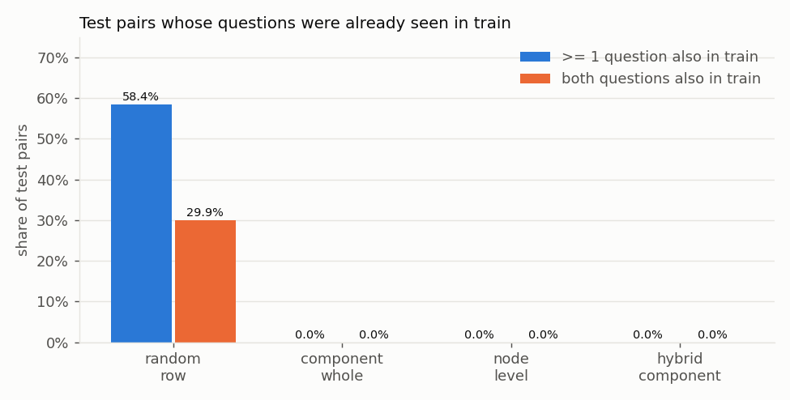

# Split Strategy

Reproduce with `python scripts/make_splits.py`. Configuration: [configs/data.yaml](../configs/data.yaml)
(seed 42, 80/10/10). The full comparison is in `artifacts/phase1/split_comparison.json`.

## 1. The leakage risk

Each row is a *pair* of questions, but questions are reused heavily:

- 111,780 qids (20.8%) appear in more than one pair; the most frequent appears in **157** pairs.
- **61.3%** of pairs contain at least one question that also appears in another pair.

View questions as nodes and pairs as edges. Two questions count as the same node when their text
matches after lowercasing and whitespace collapse. This merges 715 texts that were posted under several qids.
The resulting graph has 537,151 nodes and 200,338 connected components. The largest component
holds 17,624 pairs (4.4%), and 38.6% of pairs form an isolated single-edge component.

With a **random row split**, the same question appears on both sides of the split. The model can then
memorise question identity instead of learning to compare meaning. Worse, **labels propagate
transitively**: if train says A≡B and B≡C, then a test pair (A, C) is answered without looking at the text.

## 2. Strategies compared

Every strategy uses the same 404,287 valid pairs; 3 empty or placeholder rows are excluded.
Leakage numbers are for the **test** split (val is nearly identical).

| Strategy | Retained | Train / Val / Test pairs | Pos. rate train / val / test | Test pairs with ≥1 question in train | Test pairs with both in train | Transitive-label rule on test |
|---|---|---|---|---|---|---|
| A. Random row (stratified) | 100% | 323,429 / 40,429 / 40,429 | 36.9 / 36.9 / 36.9 % | **58.4%** | **29.9%** | fires on **21.1%** of test pairs, **99.9%** precise, recovers **57.1%** of all positives |
| B. Whole components | 100% | 320,559 / 41,840 / 41,888 | 36.1 / 41.0 / 39.2 % | 0% | 0% | never fires |
| C. Node-level (√-balanced) | **43.0%** | 139,158 / 17,530 / 17,135 | 36.7 / 37.2 / 37.0 % | 0% | 0% | never fires |
| **D. Hybrid (chosen)** | **94.2%** | 304,384 / 38,138 / 38,420 | 34.8 / 35.6 / 35.9 % | 0% | 0% | never fires |

**Transitive-label probe.** This rule uses no model and never reads the text. It predicts "duplicate"
whenever both test questions are already linked by training duplicate edges. Under a random split it
labels more than half of the test positives with 99.9% precision. Any model evaluated on a random split
can harvest the same shortcut, so its scores would be inflated in an unmeasurable way. **Strategy A is rejected.**

**B: whole components.** This is perfectly question-disjoint and loses no data. But the largest component (4.4% of
data, 52.8% positive) is ~44% of a 10% split wherever it lands. Split sizes and positive rates therefore
depend heavily on the seed. Over 10 seeds, the test share ranged 10.1–14.2% and the test positive rate
**37.1–42.6%**. Stratifying components by size bucket helps small components but cannot fix a handful
of giant ones. **Rejected: unstable, and val/test would be dominated by a few hubs.**

**C: node-level.** Each question is randomly assigned to a split, and pairs whose two questions
disagree are dropped. It is disjoint and representative, but it discards 57% of the data. **Rejected: too wasteful.**

**D: hybrid (chosen).**
1. Components with **≤ 500 pairs** (90% of data) are assigned **whole**. Assignment is stratified by
   component-size bucket (1, 2, 3–5, 6–10, 11–50, 51–100, 101–500 pairs), so every split receives ~80/10/10
   of each bucket and therefore the same mix of isolated pairs and moderately reused questions.
2. The 19 components with **> 500 pairs** (10% of data, hub questions) are split **per question**. A pair is
   kept only if both of its questions land in the same split; the rest are dropped (23,345 pairs).
3. Per-question split probabilities are p_s ∝ √ratio_s (0.586 / 0.207 / 0.207), **not** 0.8/0.1/0.1.
   A pair survives in split *s* with probability p_s², so plain ratios would keep only 1% of hub pairs in each
   of val/test versus 64% in train. My first implementation did exactly that, and it left hub pairs at 8.1% of
   train but 1.1–1.4% of val/test. The √ correction makes the *retained pairs* 80/10/10.

## 3. Resulting split (frozen)

| Split | Pairs | Share | Positive rate | Isolated / small (2–10) / medium (11–500) / large (>500) components |
|---|---|---|---|---|
| train | 304,384 | 79.9% | 34.78% | 41.0 / 33.7 / 20.8 / 4.5 % |
| val | 38,138 | 10.0% | 35.61% | 40.9 / 33.7 / 21.0 / 4.4 % |
| test | 38,420 | 10.1% | 35.93% | 40.6 / 33.4 / 21.2 / 4.8 % |
| dropped (hub cross-split) | 23,345 | – | 68.6% | – |
| excluded (empty or `n/a` question) | 3 | – | – | – |

Stability across 10 seeds: test positive rate 33.9–36.2%, test share 9.4–9.6% of all rows.

**Overlap checks on the frozen split:**
- train∩val, train∩test and val∩test share **0 questions** (normalised-text identity) and 0 pair ids. This is enforced by tests.
- Under a much looser identity (lowercase, strip all punctuation), 24 val and 26 test questions also
  occur in train. They touch 0.22% and 0.10% of pairs. This is residual near-duplicate leakage, accepted and documented.
- Semantic paraphrases of training questions can of course appear in val/test. That is the task itself, not leakage.

## 4. Why this choice

- **Realism:** a deployed duplicate detector mostly scores *new* questions. A question-disjoint test
  set measures exactly that.
- **Comparability:** every split has the same component-size profile and a positive rate within 1.2 pp of the others.
- **Retention:** 94.2% of valid pairs are kept, compared with 43% for pure node-level.
- **Honesty about the shortcut:** because frequency and graph features are also excluded as model inputs
  ([problem_definition.md](problem_definition.md)), the scores reflect text understanding.

## 5. Limitations

- **Hub questions are under-represented.** Dropping cross-split hub pairs lowers the share of
  large-component pairs from 10.0% (raw) to ~4.5% in every split. The dropped pairs are 68.6% positive,
  so the overall positive rate falls from 36.9% to ~35%. Every split is affected equally, but results
  describe this filtered distribution, not the raw one.
- **Not comparable to published Quora numbers.** Most published results use random or Kaggle splits with
  question overlap. Our scores should be expected to be *lower* and are not directly comparable.
- The identity key merges only exact re-posts. Near-duplicate questions with trivial edits across
  splits are possible (measured above as < 0.25% of pairs).
- The cap of 500 was chosen by inspection of the component-size distribution, not tuned. Caps of 100–1000
  put 16–8.5% of the data into the node-level regime.
- Kaggle's `test.csv` is unlabelled and is not used at all.

## 6. Usage rules (binding for later phases)

- `train.csv`: fitting models, vocabularies, embeddings for clustering, and cluster models.
- `val.csv`: model selection, threshold tuning, feature selection, clustering decisions, calibration.
- `test.csv`: **touched once**, in Phase 8, after everything is frozen. `tests/test_splits.py` checks
  its hash against `split_metadata.json` to detect accidental modification.
